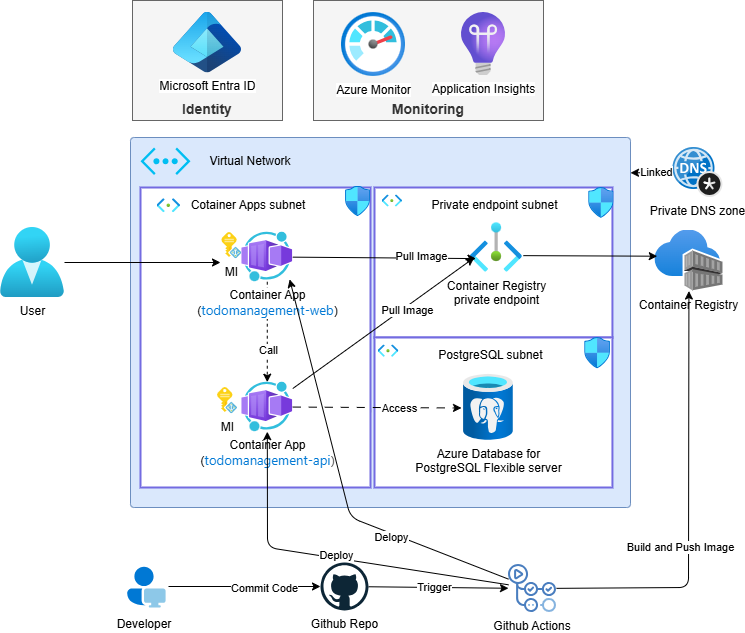

# Todo Management v2

[English](README.md) | [简体中文](README-zh_CN.md) | [日本語](README-ja_JP.md)

Full-stack sample for AI-augmented Todo Management. The v2 stack is **serverless and identity-aware**: an Azure Functions (Python) backend talks to Azure Cosmos DB (NoSQL + Gremlin) and Azure OpenAI, a Vue 3 + Vite SPA is hosted on Azure Static Web Apps, and an Azure AI Foundry agent provides an in-app chat experience.

## System Overview

The infrastructure is designed to be **serverless, identity-based, and AI-ready**, with every backend dependency reachable via Microsoft Entra ID.



## Architecture At A Glance
- **Backend**: Azure Functions (Python 3.11, anonymous HTTP auth, system-assigned managed identity) exposing Todo / Project / Conversation / Tool / Chat / Graph endpoints
- **Data**: Azure Cosmos DB serverless account with a SQL database (`todo-db`: `todos`, `owners`, `projects`, `conversations`) and a Gremlin database (`todo-graph-db` / `todo-graph`) holding `BLOCKED_BY`, `PRECEDES`, `SUBTASK_OF`, `SIMILAR_TO` edges
- **AI**: Azure OpenAI (`gpt-5.4-mini` for chat, `text-embedding-3-small` for vector search) and an Azure AI Foundry agent invoked from the Function App via the `azure.ai.projects` SDK
- **Frontend**: Vue 3 + Vite SPA on Azure Static Web Apps (Todos, Todo Edit, Projects, and a Cytoscape-based Project Graph view), with MSAL sign-in
- **Identity**: Microsoft Entra ID app registration for the SPA (`User.Read`, `Calendars.Read`); managed identity on the Function App used for Gremlin (Cosmos data plane), Foundry, and OpenAI when AAD mode is enabled
- **Reference**: `docs/ARCHITECTURE_GUIDE.md`

## Repository Structure
- `src/api`: Azure Functions backend (`function_app.py` HTTP routes, `functions/` CRUD modules, `services/` for Cosmos / OpenAI / Foundry / Gremlin)
- `src/web`: Vue 3 SPA (MSAL sign-in, Todos / Projects / Project graph / Chat features)
- `infra`: Bicep templates and `deploy.ps1` for Cosmos, Functions, SWA, OpenAI, Foundry, and the Graph app registration
- `docs`: architecture and supporting documentation
- `handson`: step-by-step deployment / quick reference / troubleshooting guides
- `foundry-agent-config.json`: reference Foundry agent definition (instructions, built-in tools, custom `estimate_hours` tool)

## Local Run
Prerequisites: Python 3.11, Azure Functions Core Tools v4, Node 18+, npm.

API (Azure Functions)
```powershell
cd src\api
copy local.settings.example.json local.settings.json
python -m venv .venv
.\.venv\Scripts\activate
pip install -r requirements.txt
func start
# Health check: http://localhost:7071/api/health
```
Edit `local.settings.json` to point at a real Cosmos DB account (or the local Cosmos emulator), Azure OpenAI deployment, and Foundry project endpoint. The Functions code auto-creates missing Cosmos databases / containers when `COSMOS_AUTO_CREATE=true`.

Web
```powershell
cd src\web
copy .env.example .env.local
npm install
npm run dev  # http://localhost:5173
```
During local development, Vite proxies `/api` to the local Functions host. For production, run `npm run build` (output in `dist/`) and deploy to Azure Static Web Apps; SWA forwards `/api/*` to the linked Function App.

## HTTP API Surface
All endpoints are served under `/api` (see `src/api/function_app.py`):

| Method | Route | Purpose |
| --- | --- | --- |
| GET | `/health` | Liveness probe |
| GET / POST | `/todos` | List / create todos (vector + keyword search via `?search=`) |
| PATCH / DELETE | `/todos/{todo_id}` | Update / delete a todo |
| POST | `/generate-todos` | Seed demo todos (auto-creates a project if needed) |
| POST | `/owners` | Create an owner |
| GET / POST | `/projects` | List / create projects |
| GET / PATCH / DELETE | `/projects/{project_id}` | Read / update / delete a project |
| POST | `/tools/estimate-hours` | Vector-search-based effort estimation (Foundry custom tool) |
| POST | `/chat` | Foundry agent proxy + transcript persistence |
| GET | `/conversations` | List saved chat transcripts |
| GET / DELETE | `/conversations/{doc_id}` | Read / delete a transcript |
| GET | `/graph/related` | Traverse Gremlin edges (`?todoId=...&relation=SIMILAR_TO`) |

The user identity is resolved from `x-user-id` header / `userId` query / JSON body, defaulting to `demo-user` for local dev.

## Deployment
The IaC flow lives under `infra/`:

1. Run `azd provision` to create or update Cosmos, Foundry and model deployments, the Function App infrastructure, Static Web App, ACR, Container Apps, Entra applications, identities, RBAC, and Foundry connections.
2. Run `azd deploy` to build and activate the Cosmos MCP image, create or update the Foundry Agent, publish the Function code and Static Web App, link the API backend, and run health checks.
3. Run `azd up` when both phases should execute in order.
4. Optional: customize Cosmos MCP Toolkit settings before `azd provision`:

```powershell
azd env set COSMOS_MCP_CLIENT_ID "<mcp-app-client-id>"   # optional; leave unset to auto-create the Entra app

# Optional: create ACR in the same Bicep deployment (enabled by default)
azd env set COSMOS_MCP_ACR_NAME ""
azd env set COSMOS_MCP_ACR_SKU "Basic"

# Option A: provide full image directly
azd env set COSMOS_MCP_IMAGE "<acr>.azurecr.io/mcp-toolkit:<tag>"

# Option B: let Bicep compose image from ACR + repo/tag (COSMOS_MCP_IMAGE can stay empty)
azd env set COSMOS_MCP_IMAGE_REPOSITORY "mcp-toolkit"
azd env set COSMOS_MCP_IMAGE_TAG "latest"
```

The deploy phase builds and pushes the MCP Toolkit image through ACR remote build; local Docker isn't required:

```powershell
azd provision
azd deploy

# Optional overrides
azd env set COSMOS_MCP_AUDIENCE ""
azd env set COSMOS_MCP_APP_NAME ""
azd env set COSMOS_MCP_ENV_NAME ""
azd env set COSMOS_MCP_LAW_NAME ""
azd env set COSMOS_MCP_CPU "0.5"
azd env set COSMOS_MCP_MEMORY "1Gi"
```

When required values are present (`COSMOS_MCP_CLIENT_ID` and a resolved image), `infra/main.bicep` deploys the managed environment, Container App, and Cosmos RBAC bindings. If `COSMOS_MCP_CLIENT_ID` is left empty, the template registers a dedicated Entra application (with the `Mcp.Tool.Executor` app role) and uses its client id. If `deployCosmosMcpAcr` is enabled (default), it also creates ACR and grants AcrPull to the Container App managed identity. If required values are missing, MCP deployment is skipped safely.

5. Validate Todo CRUD, vector search, Project graph, and the Foundry chat round-trip.

See `handson/DEPLOY_GUIDE.md` for the full English walkthrough.

## Related Docs
- `docs/ARCHITECTURE_GUIDE.md`
- `handson/DEPLOY_GUIDE.md`
- `handson/QUICK_REFERENCE.md`
- `handson/TROUBLESHOOTING.md`
- `infra/README.md`
