# Todo Management v2 デプロイ ガイド（Azure Portal 手順）

[English](DEPLOY_GUIDE_GUI.md) | [简体中文](DEPLOY_GUIDE_GUI-zh_CN.md) | [日本語](DEPLOY_GUIDE_GUI-ja_JP.md)

このガイドでは、初学者向けの手順を説明します。受講者に GitHub アカウントや Git の事前知識は必要ありません。Azure リソースは Azure Portal で作成し、アプリケーションは Azure Cloud Shell からビルドしてデプロイします。講師は [`INSTRUCTOR_PREP_GUIDE-ja_JP.md`](INSTRUCTOR_PREP_GUIDE-ja_JP.md) に従って共有 MCP コンテナー イメージを準備します。IaC を使用する手順については、[`DEPLOY_GUIDE.md`](DEPLOY_GUIDE.md) を参照してください。

想定所要時間: 90～120 分。

---

## 開始前の準備

講師から次の 8 項目を受け取ってください。

- Todo Management v2 のパブリック リポジトリ URL
- ワークショップ用 ACR のログイン サーバー（例: `workshopacr.azurecr.io`）
- MCP イメージ名 `mcp-toolkit`
- MCP イメージ タグ（例: `workshop-20260727`）
- 割り当てられた Container Apps 環境（例: `cae-todomanagement-workshop-01`）
- 環境のリソース グループ（例: `rg-todomanagement-instructor`）
- 環境のリージョン（例: `japaneast`）
- 一意の Container App 名（例: `mcp-toolkit-p01`）

必要なものは、ブラウザー、インターネット接続、Azure サブスクリプション、および [Azure Cloud Shell](https://learn.microsoft.com/azure/cloud-shell/overview) を使用する権限です。Cloud Shell で使用するシェルを尋ねられたら、**PowerShell** を選択してください。

受講者アカウントには、少なくとも次の権限が必要です。

- 自分が作業するリソース グループに対する **Owner**（少なくとも Contributor 以上）
- Microsoft Entra ID の **Application Developer**（アプリ登録を作成できる権限）

次の流れで進めます。

1. Portal で Azure リソースを作成します。
2. 2 つの Entra アプリ登録とマネージド ID を構成します。
3. 講師が提供する MCP イメージを Container Apps にデプロイします。
4. Foundry Agent を作成して接続します。
5. パブリック ソースをクローンし、Cloud Shell から API と Web アプリをデプロイします。
6. アプリケーションをテストした後、ワークショップ用リソースを削除します。

GitHub リポジトリ、資格情報、シークレット、ワークフローを作成する必要はありません。

---

## このガイドで使用する用語

| 用語                           | このハンズオンでの意味 |
| ------------------------------ | ---------------------- |
| **Resource Group**       | すべての v2 リソースを格納する論理コンテナー（既定名は `rg-todomanagementv2-dev`）です。 |
| **Function App**         | `src/api/` をホストする Linux Flex Consumption プラン上の Azure Functions です。 |
| **Static Web App (SWA)** | `src/web/` からビルドした Vue 3 SPA をホストします。 |
| **Cosmos DB serverless** | SQL コンテナー（`todos` / `owners` / `projects` / `conversations`）と Gremlin グラフ（`todo-graph-db` / `todo-graph`）を保存します。 |
| **Microsoft Foundry**    | `gpt-5.4-mini` と `text-embedding-3-small` を提供します。 |
| **App registration**     | SPA のサインイン、および必要に応じてサーバーから Foundry への同意に使用する Entra ID の ID です。 |
| **Managed identity**     | Cosmos Gremlin と Azure OpenAI の AAD トークン取得に使用する、Function App のシステム割り当て ID です。 |

---

## フェーズ 1. Azure Portal でのインフラストラクチャ作成

### 1.1 リソース グループの作成

1. `https://portal.azure.com` を開いてサインインします。
2. **Resource groups** を検索し、**+ Create** を選択します。
3. Subscription で使用するサブスクリプションを選択します。**Resource group** に `rg-todomanagementv2-dev`、**Region** に `Japan East`（または Cosmos、Foundry、Functions Linux、SWA のすべてをサポートする任意のリージョン）を指定します。
4. **Review + create** → **Create** を選択します。

📖 参考: [https://learn.microsoft.com/azure/azure-resource-manager/management/manage-resource-groups-portal](https://learn.microsoft.com/azure/azure-resource-manager/management/manage-resource-groups-portal)

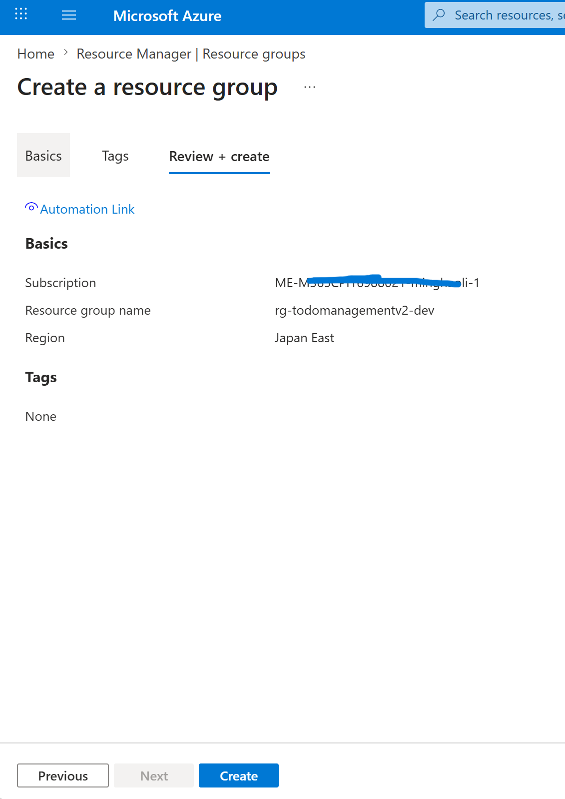

---

### 1.2 NoSQL 用 Cosmos DB アカウントの作成

1. **Azure Cosmos DB** を検索し、**+ Create** を選択します。
2. API には **Azure Cosmos DB for NoSQL** を選択します。
3. **Basics** で次を設定します。
   - Workload Type: `Learning`
   - Resource group: `rg-todomanagementv2-dev`
   - Account name: `cosmos-todomanagement-<unique>`（小文字の英字と数字）
   - Availability Zones: `Disable`
   - Location: リソース グループと同じ
   - Capacity mode: **Serverless**
4. **Global distribution** で次を設定します。
   - Geo-Redundancy: `Disable`
   - Multi-region Writes: `Disable`
5. **Networking** で次を設定します。
   - Connectivity method: `All networks`。必要に応じて後で制限してください。
6. **Backup Policy** は既定値のままで問題ありません。
7. **Security** で次を設定します。
   - Key-based Authentication: `Disable`。認証には Entra ID を使用します。
   - Data Encryption: `Service-managed key`
8. **Review + create** → **Create** を選択します。
   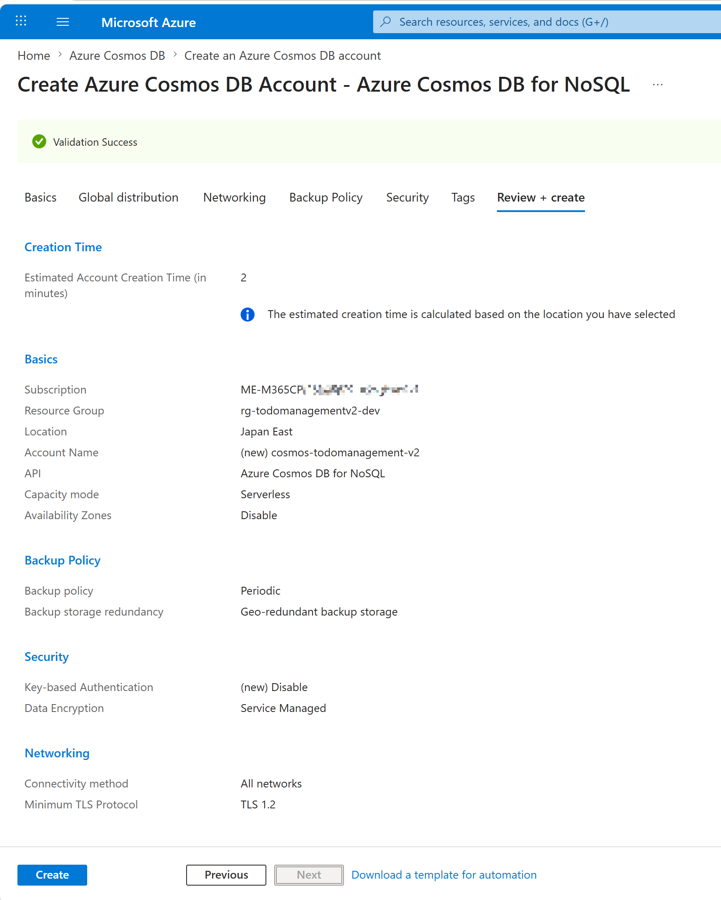
   プロビジョニング完了後:
9. アカウントを開き、**Overview** で **URI**（`https://<cosmos>.documents.azure.com:443/`）をコピーして保存します。フェーズ 3 とフェーズ 4 で使用します。
10. **Data Explorer** → **New Database** を選択して ID に `todo-db` を入力します。その後、次の 4 つのコンテナーを作成します。

   | Container         | Partition key |
   | ----------------- | ------------- |
   | `todos`         | `/owner_id` |
   | `owners`        | `/id`       |
   | `projects`      | `/owner_id` |
   | `conversations` | `/owner_id` |

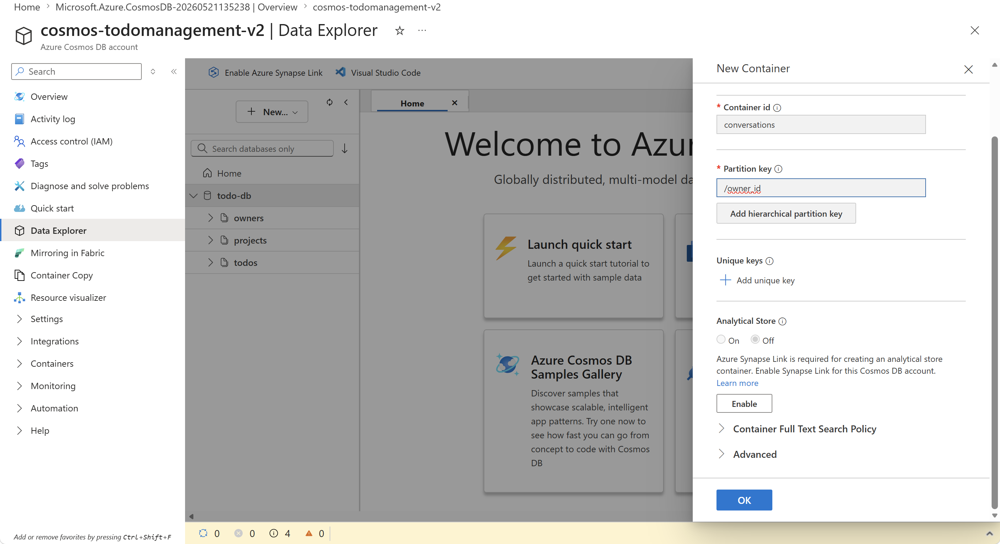
📖 参考: [https://learn.microsoft.com/azure/cosmos-db/nosql/quickstart-portal](https://learn.microsoft.com/azure/cosmos-db/nosql/quickstart-portal)

---

### 1.3 Gremlin API 用 Azure Cosmos DB アカウントの作成

1. **Azure Cosmos DB** を検索し、**+ Create** を選択します。
2. API には **Azure Cosmos DB for Apache Gremlin** を選択します。
   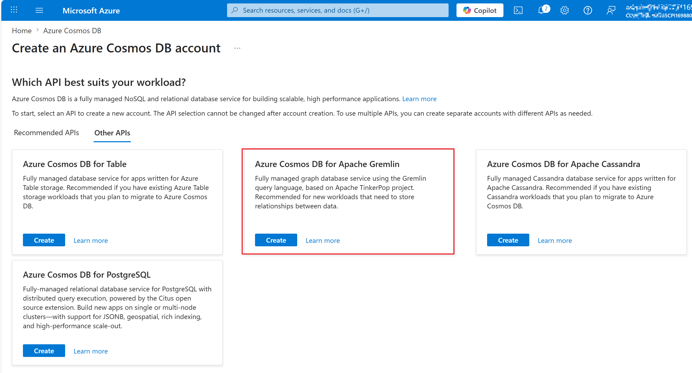
3. **Basics** で次を設定します。
   - Workload Type: `Learning`
   - Resource group: `rg-todomanagementv2-dev`
   - Account name: `cosmosgre-todomanagement-<unique>`（小文字の英字と数字）
   - Availability Zones: `Disable`
   - Location: リソース グループと同じ
   - Capacity mode: **Serverless**
4. **Global distribution** で次を設定します。
   - Geo-Redundancy: `Disable`
   - Multi-region Writes: `Disable`
5. **Networking** で次を設定します。
   - Connectivity method: `All networks`。必要に応じて後で制限してください。
6. **Backup Policy** は既定値のままで問題ありません。
7. **Security** で次を設定します。
   - Data Encryption: `Service-managed key`
8. **Review + create** → **Create** を選択します。
   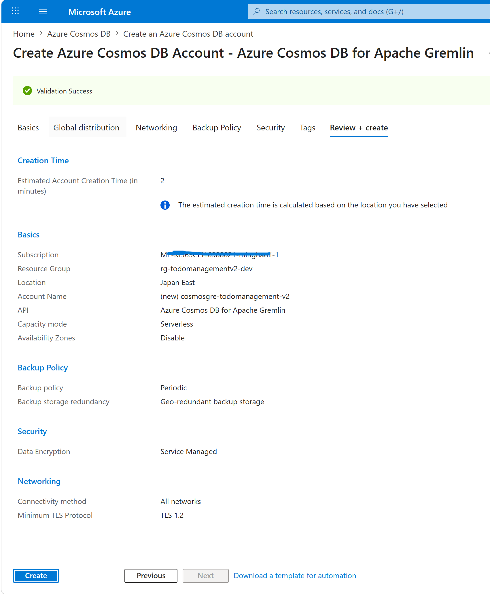
   プロビジョニング完了後:
9. アカウントを開き、**Data Explorer** → **New Graph** を選択します。
   - **Database id**: `todo-graph-db`
   - **Graph id**: `todo-graph`
   - **Partition key**: `/owner_id`
     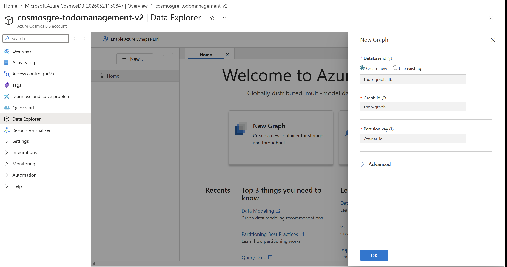

---

### 1.4 Foundry リソースの作成とモデルのデプロイ

1. **Microsoft Foundry** → **Foundry** → **+ Create** を選択します。
2. **Basics** で次を設定します。
   - Resource group: `rg-todomanagementv2-dev`
   - Name: `foundry-todomanagement-<unique>`（小文字の英字と数字）
   - Region: リソース グループと同じ
3. **Review + create** → **Create** を選択します。

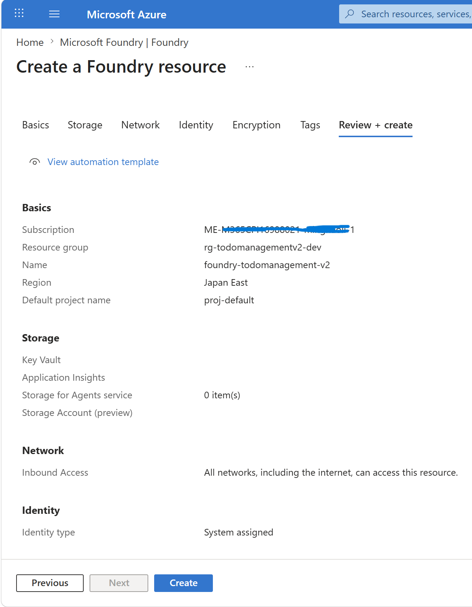
プロビジョニング完了後:
4. Foundry リソースを開き、**Access control (IAM)** → **+ Add role assignment** を選択します。
5. **Foundry User** ロールを選択し、**Next** を選択します。
6. **Assign access to** で **User, group, or service principal** → **+ Select members** を選択し、サインイン中のアカウントを選択して **Review + assign** を選択します。
7. ロールの割り当てが反映されるまで数分待ちます。
8. Foundry リソースを開き、**Go to Foundry portal** を選択します。`Project endpoint` をコピーして保存します。
9. **Discover** → **Models** → **Deploy a base model** を開き、`text-embedding-3-small` を検索します。
10. `text-embedding-3-small` を選択し、**Deploy** → **Default settings** を選択します。
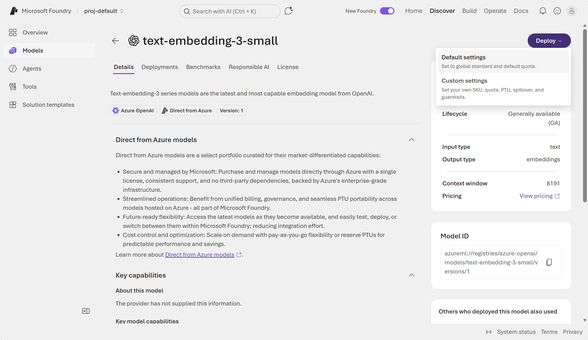
11. **Discover** → **Models** → **Deploy a base model** を開き、`gpt-5.4-mini` を検索します。
12. `gpt-5.4-mini` を選択し、**Deploy** → **Default settings** を選択します。
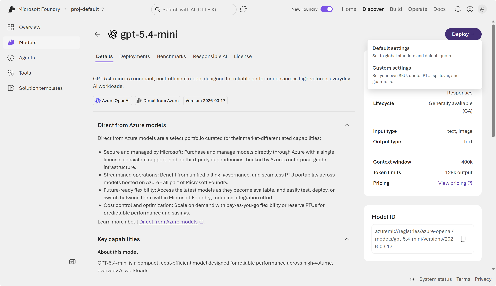

---

### 1.5 Function App と Storage の作成

1. **Function App** を検索し、**+ Create** を選択します。
2. `Flex Consumption` を選択します。
3. **Basics** で次を設定します。
   - Resource group: `rg-todomanagementv2-dev`
   - Function App name: `func-todomanagement`
   - **Secure unique default hostname** が表示される場合は有効にします（リージョンやポータル表示言語によっては表示されない場合があります）。
   - Region: リソース グループと同じ
   - Runtime stack: `Python` 3.11
   - Instance size: `2048 MB`
   - Zone redundancy: `Disabled`
4. **Storage** で、新しいストレージ アカウント `satodomanagement<unique>`（小文字と数字、最大 24 文字）を作成します。
5. **Azure OpenAI** は既定値のままにします。
6. **Networking** では、パブリック アクセスを有効にし、受信制限を設定しません（必要に応じて後で制限してください）。
7. **Monitoring** で Application Insights を有効にし、必要に応じて新しいコンポーネントを作成します。
8. **Durable Functions** は既定値のままにします。
9. **Deployment** は既定値のままにします。
10. **Authentication** で Authentication type を `Managed identity` に変更します。
    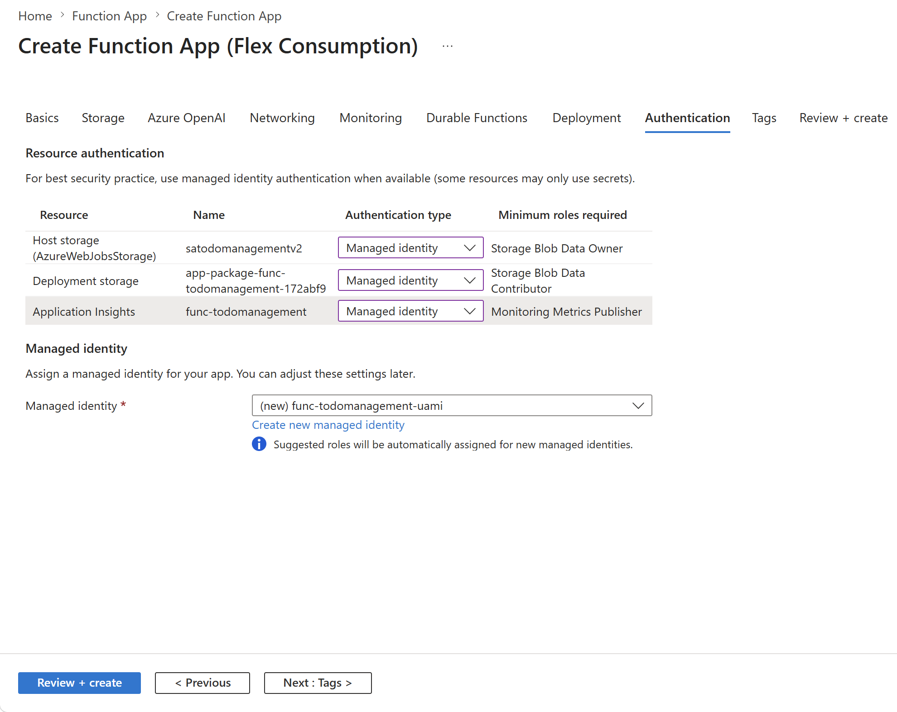
11. **Review + create** → **Create** を選択します。
    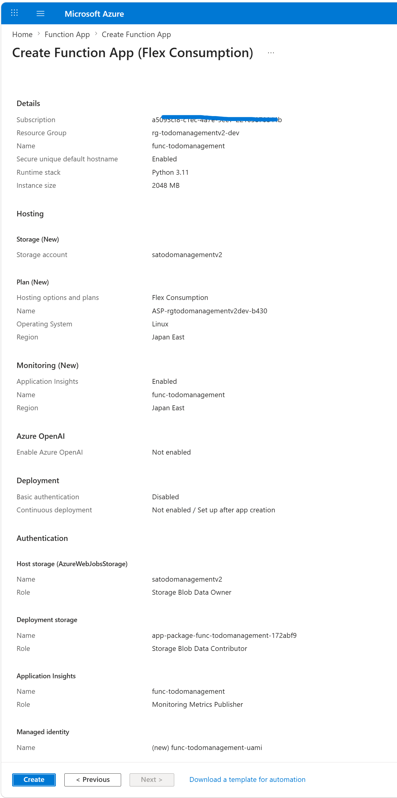
12. プロビジョニング完了後、Function App を開き、**Settings** → **Identity** → **User assigned** → **func-todomanagement-uami** に進みます。**Client Id** と **Object (principal) ID** をコピーして保存します。
    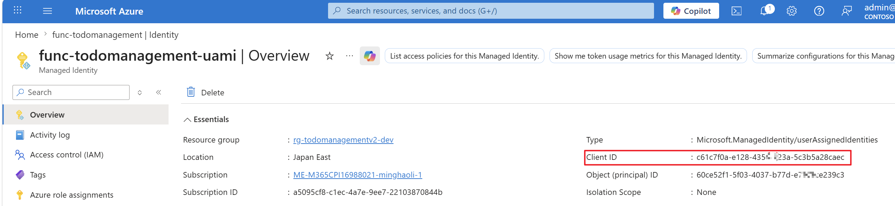

📖 参考: [https://learn.microsoft.com/azure/azure-functions/functions-create-function-app-portal](https://learn.microsoft.com/azure/azure-functions/functions-create-function-app-portal)

---

### 1.6 Static Web App の作成

1. **Static Web Apps** を検索し、**+ Create** を選択します。
2. **Basics** で次を設定します。
   - Resource group: `rg-todomanagementv2-dev`
   - Name: `stapp-todomanagement-<unique>`
   - Plan type: `Standard`
   - Deployment details: **Other** を選択
3. **Deployment configuration** で **Deployment token** を選択します。
4. **Advanced** で、**Region for Azure Functions API and staging environments** に `East Asia` を選択します。
5. **Review + create** → **Create** を選択します。
   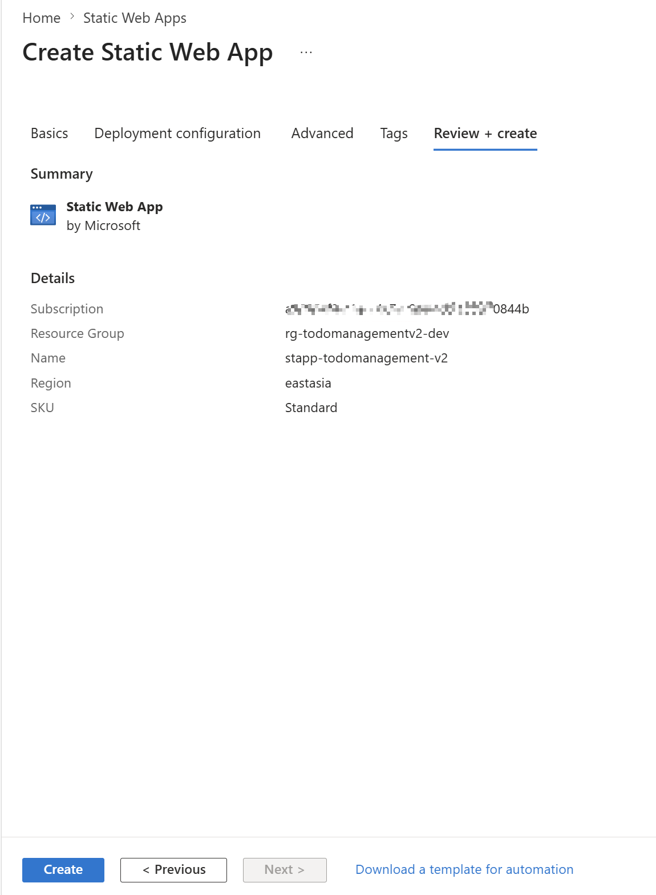
6. プロビジョニング完了後、SWA を開いて次の情報をコピーし、フェーズ 4 で使用できるよう保存します。
   - **Manage deployment token**
   - **URL**

📖 参考: [https://learn.microsoft.com/azure/static-web-apps/getting-started](https://learn.microsoft.com/azure/static-web-apps/getting-started)

---

## フェーズ 2. ID とアクセス許可の構成

### 2.1 Microsoft Entra ID への SPA 登録

1. **Microsoft Entra ID** → **App registrations** → **+ New registration** を開きます。
2. Name に `todomanagementv2-spa` を入力します。
3. Supported account types には **Accounts in this organizational directory only** を選択します。
4. Redirect URI には **Single-page application (SPA)** → `https://<swa>.azurestaticapps.net/` を指定します。
5. **Register** を選択します。

作成後:
6. **Authentication** → **+ Add URI** で、次の URI を追加して保存します。
   - `https://<swa>.azurestaticapps.net`（末尾スラッシュなし）
   - `https://<swa>.azurestaticapps.net/`（末尾スラッシュあり）
   - 任意: `http://localhost:5173`（末尾スラッシュなし）
   - 任意: `http://localhost:5173/`（末尾スラッシュあり）
7. **Overview** ページから次の値をコピーします。
    - **Application (client) ID** → `CLIENT_ID` として保存
    - **Directory (tenant) ID** → `TENANT_ID` として保存

📖 参考: [https://learn.microsoft.com/entra/identity-platform/quickstart-register-app](https://learn.microsoft.com/entra/identity-platform/quickstart-register-app)

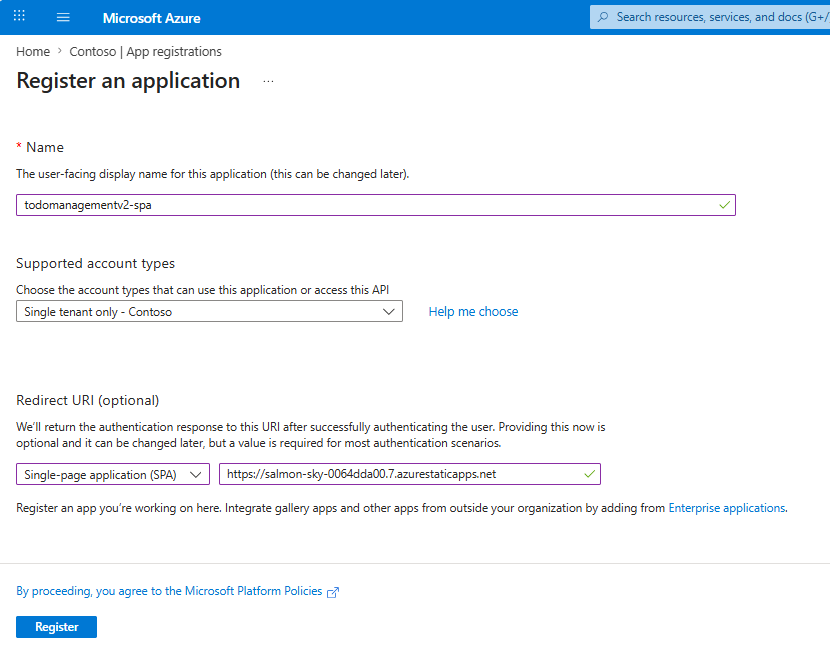

---

### 2.2 Microsoft Entra ID への MCP API 登録

共有イメージに含まれるのはアプリケーション コードだけです。受講者ごとに、自分の MCP エンドポイント用の ID を個別に作成します。

1. **Microsoft Entra ID** → **App registrations** → **+ New registration** を開きます。
2. Name に `todomanagementv2-mcp-api` を入力します。
3. Supported account types には **Accounts in this organizational directory only** を選択します。
4. **Redirect URI** は空のままにし、**Register** を選択します。
5. **Application (client) ID** をコピーし、`MCP_CLIENT_ID` として保存します。
6. **Expose an API** → **Application ID URI** の横にある **Add** を選択し、`api://<MCP_CLIENT_ID>` を承認します。
7. **App roles** → **Create app role** を開き、次の値を入力します。| Setting              | Value                                  |
   | -------------------- | -------------------------------------- |
   | Display name         | `MCP Tool Executor`                  |
   | Allowed member types | `Both (Users/Groups + Applications)` |
   | Value                | `Mcp.Tool.Executor`                  |
   | Description          | `Execute Cosmos DB MCP tools`        |
   | Enable this app role | Checked                                |
8. **Apply** を選択します。

Container App の URL が作成されるフェーズ 3 で、リダイレクト URI を追加します。

---

### 2.3 アプリケーション ID へのアクセス権の付与

1. Function App の User Assigned Managed Identity に `Cosmos DB Built-in Data Contributor` ロールを割り当てます。
   a. まず Azure Portal の GUI で、NoSQL アカウント（および Gremlin アカウント）のデータ プレーン ロール割り当て画面から、`Cosmos DB Built-in Data Contributor` を `func-todomanagement-uami` に割り当ててください。
   b. ポータルでデータ プレーン ロール割り当てを実行できない場合は、Cloud Shell（PowerShell）で次のコマンドを実行します。

   ```powershell
   az cosmosdb sql role assignment create `
      --account-name "<your-cosmos-db-account-name>" `
      --resource-group "<your-resource-group-name>" `
      --role-definition-id "00000000-0000-0000-0000-000000000002" `
      --principal-id "<your-azure-function-uami-object-id>" `
      --scope "/"

   az cosmosdb sql role assignment create `
      --account-name "<your-cosmos-gremlin-db-account-name>" `
      --resource-group "<your-resource-group-name>" `
      --role-definition-id "00000000-0000-0000-0000-000000000002" `
      --principal-id "<your-azure-function-uami-object-id>" `
      --scope "/"
   ```

   `--principal-id` には **Client ID ではなく Object (principal) ID** を指定します。

   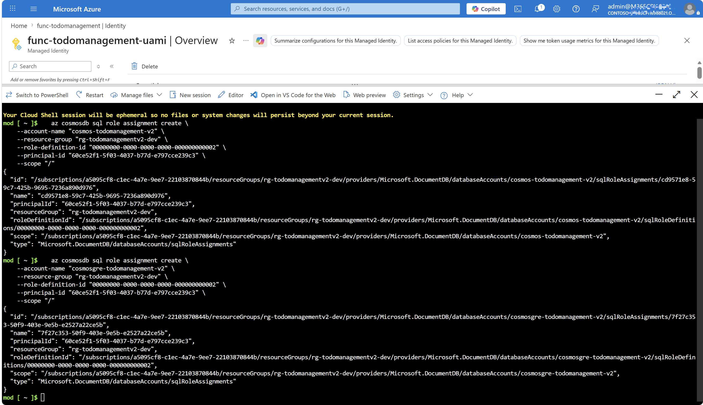
   📖 参考: [https://learn.microsoft.com/azure/cosmos-db/how-to-setup-rbac](https://learn.microsoft.com/azure/cosmos-db/how-to-setup-rbac)
2. Foundry **project** → **Access control (IAM)** → **+ Add role assignment** を開きます。
   - Role: `Foundry User`
   - Assign access to: **Managed identity** → **func-todomanagement-uami** を選択します。
     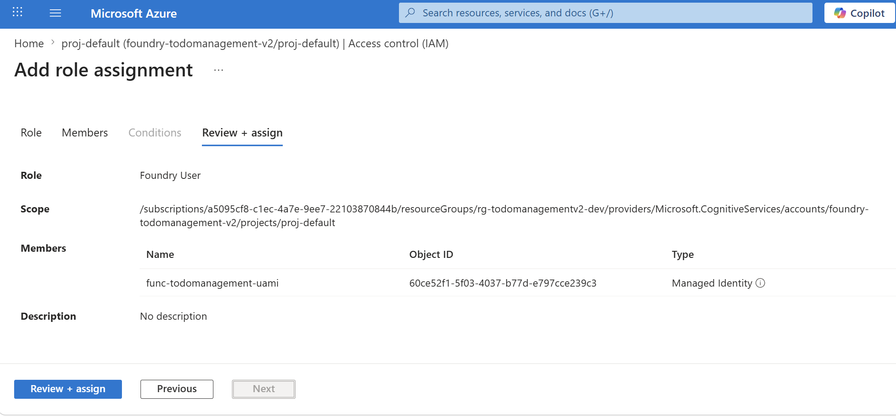
3. Foundry プロジェクトのマネージド ID に `MCP Tool Executor` ロールを付与します。
   a. GUI で実施する場合は、**Enterprise applications** → `todomanagementv2-mcp-api` → **Users and groups** → **+ Add user/group** を開きます。
   b. Principal に Foundry プロジェクトのマネージド ID（例: `<foundry-resource-name>/projects/proj-default`）を選択し、Role に `MCP Tool Executor` を選択して割り当てます。
   c. ポータルでマネージド ID を選択できない場合のみ、同じ Cloud Shell PowerShell セッションで次のコマンドを実行します。

   ```powershell
   $ResourceName = "todomanagementv2-mcp-api"
   $AppRoleName = "Mcp.Tool.Executor"
   $PrincipalName = "<your-foundry-resource-name>/projects/proj-default"
   $Resource = az ad sp list --display-name $ResourceName --query "{ AppRoleId: [0] .appRoles [?value=='$AppRoleName'].id | [0], ObjectId:[0] .id }" -o json | ConvertFrom-Json

   $Principal = az ad sp list --display-name $PrincipalName --query "{ ObjectId: [0] .id }" -o json | ConvertFrom-Json


   $spObjectId = $Resource.ObjectId 
   $body = @{
      principalId = $Principal.ObjectId
      resourceId = $Resource.ObjectId 
      appRoleId = $Resource.AppRoleId
   } | ConvertTo-Json

   az rest --method POST `
      --url "https://graph.microsoft.com/v1.0/servicePrincipals/$spObjectId/appRoleAssignedTo" `
      --headers "Content-Type=application/json" `
      --body $body 2>&1
   ```

---

## フェーズ 3. Foundry Agent の構成

### 3.1 Cosmos DB 用 MCP ツールのデプロイ

ワークショップの開始前に、講師が MCP Toolkit イメージをビルドし、次の値を共有します。

| 値                         | 例 |
| -------------------------- | -- |
| Registry                   | `workshopacr.azurecr.io` |
| Image                      | `mcp-toolkit` |
| Tag                        | `workshop-20260727` |
| Container Apps environment | `cae-todomanagement-workshop-01` |
| Environment resource group | `rg-todomanagement-instructor` |
| Environment region         | `japaneast` |
| Container App name         | `mcp-toolkit-p01` |

講師は共有 Container Apps 環境を作成済みであり、その環境に Container App をデプロイする権限を付与しています。ハンズオン中に別の環境を作成したり、MCP Toolkit リポジトリをクローンしたり、イメージをビルドしたりしないでください。

#### 3.1.1 MCP イメージを使用した Container App の作成

1. **Container Apps** を検索し、**+ Create** を選択します。
2. **Basics** で次を設定します。
   - Resource group: `rg-todomanagementv2-dev`
   - Container app name: 講師から割り当てられた一意の名前（例: `mcp-toolkit-p01`）
   - Region: 講師から提供された環境のリージョン
   - Container Apps environment: 講師から割り当てられた環境（例: `cae-todomanagement-workshop-01`）
3. **Container** で次を設定します。
   - Use quickstart image: **Unchecked**
   - Image source: **Azure Container Registry**
   - Registry: 講師から提供されたレジストリ
   - Image: 講師から提供されたイメージ
   - Image tag: 講師から提供されたタグ
   - CPU: `0.5`
   - Memory: `1 GiB`
4. 次の環境変数を追加します。

   | Name                            | Value |
   | ------------------------------- | ----- |
   | `AzureAd__ClientId`           | フェーズ 2 で取得した `MCP_CLIENT_ID` |
   | `AzureAd__TenantId`           | フェーズ 2 で取得した `TENANT_ID` |
   | `AzureAd__Audience`           | フェーズ 2 で取得した `MCP_CLIENT_ID` |
   | `COSMOS_ENDPOINT`             | 手順 1.2 で取得した NoSQL エンドポイント |
   | `OPENAI_ENDPOINT`             | 手順 1.4 で取得した Foundry project endpoint |
   | `OPENAI_EMBEDDING_DEPLOYMENT` | `text-embedding-3-small` |
   | `ASPNETCORE_ENVIRONMENT`      | `Production` |
   | `ASPNETCORE_URLS`             | `http://+:8080` |
5. 作成ウィザードの **Container** タブ下部にある **Scale** セクション（または **Scale** タブ）で次を設定します。
   - Minimum replicas: `0`
   - Maximum replicas: `1`
6. **Ingress** で次を設定します。
   - Ingress: **Enabled**
   - Ingress traffic: **Accepting traffic from anywhere**
   - Ingress type: **HTTP**
   - Target port: `8080`
7. **Review + create** → **Create** を選択し、リビジョンが **Running** になることを確認します。

割り当てられた環境を選択できない場合は、サブスクリプション、環境のリソース グループ、およびリージョンを講師に確認してください。講師は、割り当てられた環境のスコープで、受講者のアカウントに **Container Apps Contributor** を付与する必要があります。代わりの環境は作成しないでください。

レジストリまたはイメージを選択できない場合は、作業を中止し、ワークショップ用 ACR へのアクセス権と ACR の **Admin user** 設定（講師側で有効化済みか）を講師に確認してください。受講者側で ACR 設定は変更しないでください。

#### 3.1.2 Container App の実行時アクセス許可の付与

1. Container App を開き、**Settings** → **Identity** → **System assigned** に進みます。
2. **Status** を **On** に設定し、**Save** を選択します。
3. Cosmos DB for NoSQL アカウントを開き、**Access control (IAM)** で Container App のマネージド ID に **Cosmos DB Account Reader Role** を割り当てます。
4. Cloud Shell PowerShell で、Cosmos データ プレーンの読み取りロールを付与します。

   ```powershell
   $resourceGroup = "rg-todomanagementv2-dev"
   $cosmosAccount = "<your-nosql-account-name>"
   $mcpAppName = "<your-assigned-container-app-name>"
   $mcpPrincipalId = az containerapp identity show `
     --resource-group $resourceGroup `
     --name $mcpAppName `
     --query principalId -o tsv

   az cosmosdb sql role assignment create `
     --account-name $cosmosAccount `
     --resource-group $resourceGroup `
     --role-definition-id "00000000-0000-0000-0000-000000000001" `
     --principal-id $mcpPrincipalId `
     --scope "/"
   ```
5. Foundry プロジェクトを開き、**Access control (IAM)** で同じマネージド ID に **Foundry User** を割り当てます。
6. ロールの割り当てが反映された後、Container App のリビジョンを再起動します。

#### 3.1.3 MCP 認証の完了とテスト

1. 割り当てられた Container App を開き、**Application URL** をコピーします。
2. **Microsoft Entra ID** → **App registrations** → `todomanagementv2-mcp-api` → **Authentication** を開きます。
3. 次の **Single-page application (SPA)** redirect URI を追加して保存します。
   - `https://<mcp-app-url>/`
4. **Enterprise applications** → `todomanagementv2-mcp-api` → **Users and groups** → **+ Add user/group** を開きます。
5. 自分のユーザーに **MCP Tool Executor** ロールを割り当てます。
6. Container App の URL を開き、`MCP_CLIENT_ID` と `TENANT_ID` を入力してサインインします。
7. **Test Tool** → `List Databases` → **Invoke Selected Tool** を選択します。
   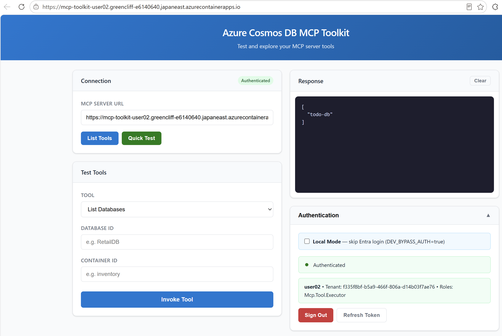

📖 参考: [Azure Cosmos DB MCP Toolkit](https://github.com/AzureCosmosDB/MCPToolKit)

---

### 3.2 Agent の作成

1. Foundry プロジェクトを開き、**Agents** → **Create agent** を選択します。Agent 名に `todomanagement-agent` を指定して作成します。
   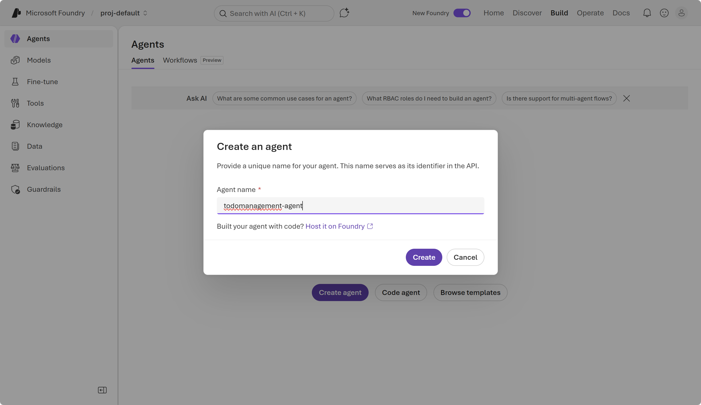
2. 次の情報を指定します。
   - **Model**: `gpt-5.4-mini`
   - **Instructions**: [../prompt/todomanagement-agent.instructions.md](../prompt/todomanagement-agent.instructions.md) の内容を指定
3. **Tools** で次を設定します。
   1. **Web search** ツールを削除します。
   2. **Azure Cosmos DB** ツールを追加します。
      a. **Add** → **Browse all tools** を選択します。
      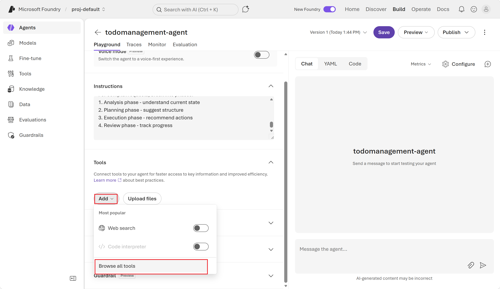
      b. **Catalog** で `Azure Cosmos DB` を検索し、ツールを選択して **Create** を選択します。
      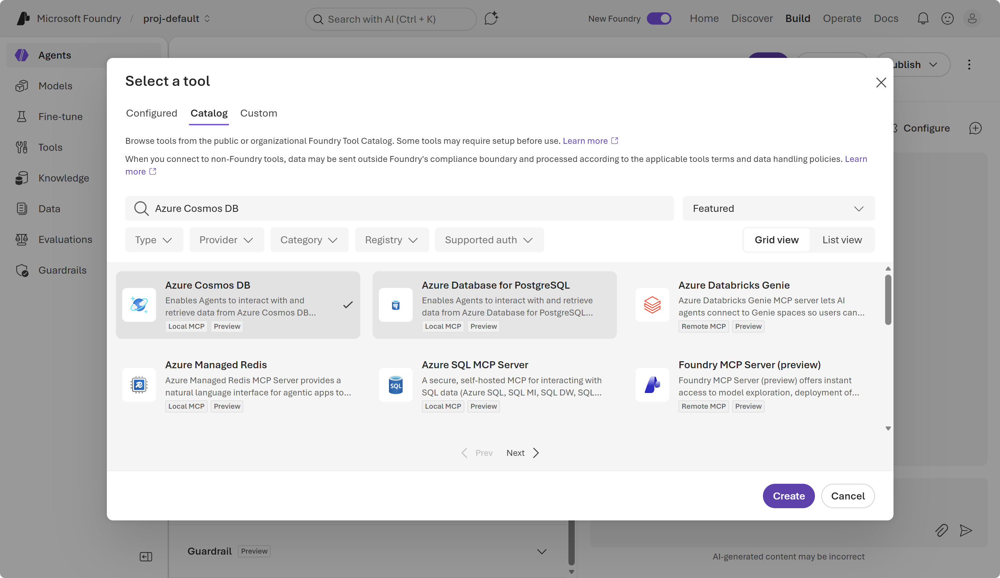
      c. **Connect tool with endpoint** を選択します。
      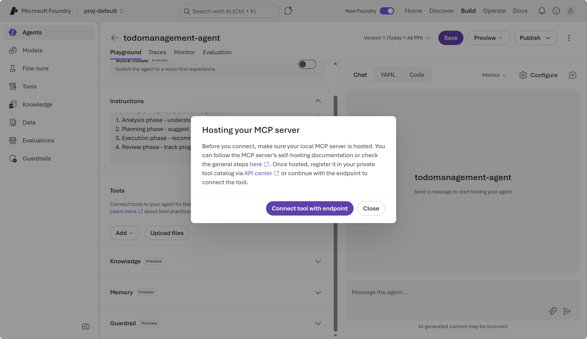
      d. **Azure Cosmos DB ツールの接続** で次を設定します。
      - **Name**: `AzureCosmosDB`
      - **Remote MCP Server endpoint**: `<container-application-url>/mcp`（例: `https://mcp-toolkit-p01.livelyforest-279726ad.japaneast.azurecontainerapps.io/mcp`）
      - **Authentication**: `Microsoft Entra`
      - **Type**: `Project Managed Identity`
        - **Audience**: フェーズ 2 で取得した `MCP_CLIENT_ID` を入力します。
          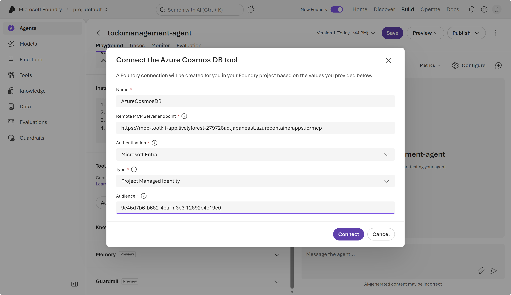
          e. **Connect** を選択します。
4. **Memory** の設定では、**メモリストアの自動作成**（Create memory store）を選択します。
5. Agent を **Save** します。**Name**（例: `todomanagement-agent`）と **Version**（例: `3`）を控えます。
6. Agent をテストします。
   1. Playground に次のメッセージを入力します。ツール呼び出しの承認を求められたら、承認してください。
      `Cosmos DB アカウント内のすべてのデータベースを一覧表示してください`
      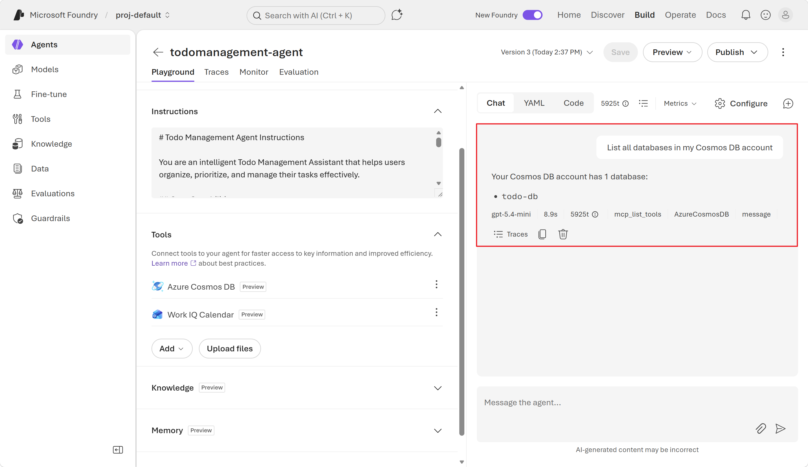
      📖 参考: [https://learn.microsoft.com/en-us/azure/foundry/agents/concepts/tool-catalog](https://learn.microsoft.com/en-us/azure/foundry/agents/concepts/tool-catalog)

---

## フェーズ 4. アプリケーションの構成とデプロイ

### 4.1 Function App のアプリケーション設定

Function App → **Settings** → **Environment variables** → **+ Add** を開き、次の変数を追加します。

| Name | Value |
| ---- | ----- |
| `AZURE_CLIENT_ID` | `<func-todomanagement-uami-client-id>`。手順 1.5 で取得した User Assigned Identity の **Client Id** |
| `COSMOS_AUTO_CREATE` | `true` |
| `COSMOS_AUTH_MODE` | `aad` |
| `COSMOS_ENDPOINT` | `https://<cosmos>.documents.azure.com:443/`。手順 1.2 で取得したエンドポイント |
| `COSMOS_DATABASE` | `todo-db` |
| `COSMOS_GREMLIN_ENDPOINT` | `https://<cosmos>.documents.azure.com:443/`。手順 1.3 で取得したエンドポイント |
| `COSMOS_GRAPH_DATABASE` | `todo-graph-db` |
| `COSMOS_GRAPH_NAME` | `todo-graph` |
| `FOUNDRY_AGENT_ENDPOINT` | `https://<foundry>.services.ai.azure.com/api/projects/proj-default`。手順 1.4 で取得した project endpoint |
| `FOUNDRY_EMBEDDING_DEPLOYMENT` | `text-embedding-3-small` |
| `FOUNDRY_AGENT_NAME` | `todomanagement-agent`。手順 3.2 で取得した Agent 名 |
| `FOUNDRY_AGENT_VERSION` | 例: `1`。手順 3.2 で取得したバージョン |

**Apply** を選択します。

> Cosmos アカウント キーを使用する場合は、RBAC を付与する代わりに `COSMOS_AUTH_MODE=key` を設定し、`COSMOS_KEY=<primary key>` を追加してください。

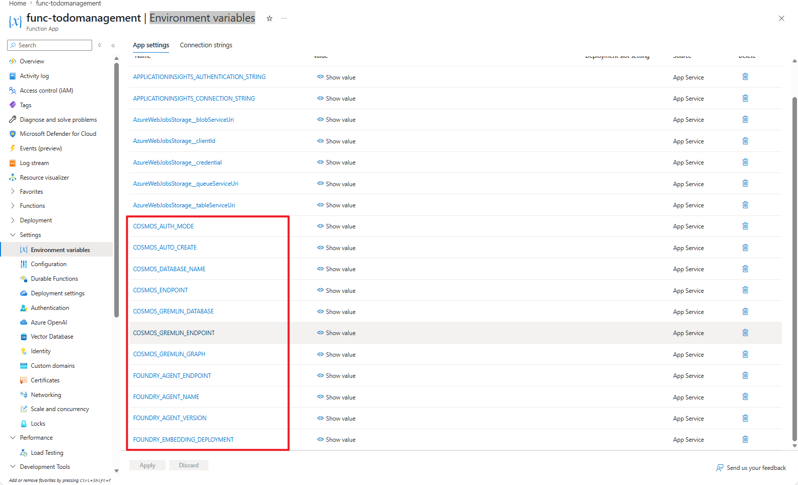

---

### 4.2 Cloud Shell でのアプリケーション ソースのクローン

1. Azure Portal で **Cloud Shell** を開き、**PowerShell** を選択します。
2. 講師から提供されたパブリック リポジトリをクローンします。

   ```powershell
   git clone https://github.com/Liminghao0922/todomanagement_v2.git

   $repoRoot = "$HOME/todomanagement_v2"
   Set-Location $repoRoot
   Get-ChildItem src
   ```

   `src` の下に `api` と `web` フォルダーがあることを確認します。受講者向けガイドで使用する Git コマンドはこれだけです。GitHub アカウントを作成したり、サインインしたりする必要はありません。
3. 正しい Azure サブスクリプションが選択されていることを確認します。

   ```powershell
   az account show --output table

   # Use this only when you need to switch subscriptions.
   # az account set --subscription "<subscription-id>"
   ```

---

### 4.3 Azure Functions Core Tools を使用した API のデプロイ

1. Cloud Shell で使用できるツールを確認します。

   ```powershell
   az version
   python --version
   func --version
   node --version
   npm --version
   ```

   Python `3.11`、Functions Core Tools `4.x`、Node.js `20.x` であることを確認します。コマンドを使用できない場合や、異なるメジャー バージョンが表示された場合は、作業を中止して講師に確認してください。講師はセッションの開始前に、ワークショップ用 Cloud Shell 環境を確認する必要があります。
2. Python アプリケーションを発行します。Core Tools が `requirements.txt` を読み取り、デプロイ ビルドを実行します。

   ```powershell
   $functionAppName = "<your-function-app-name>"

   Set-Location "$repoRoot\src\api"
   func azure functionapp publish $functionAppName --python
   ```
   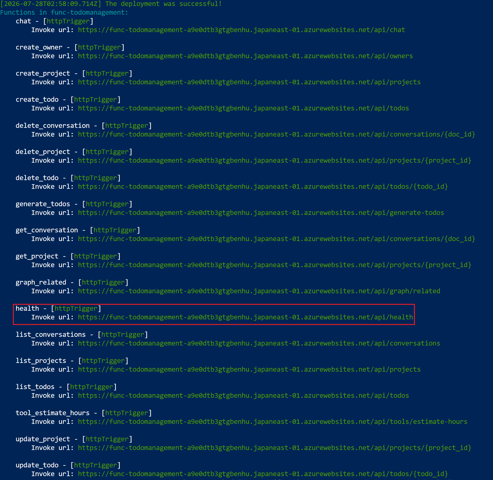
3. API を確認します。

   ```powershell
   Invoke-RestMethod "https://{function-unique-domain}.azurewebsites.net/api/health"
   ```

想定される結果: `status` が `healthy` になります。

📖 参考: [Azure Functions Core Tools を使用した Azure への発行](https://learn.microsoft.com/azure/azure-functions/functions-run-local#publish-to-azure)

---

### 4.4 Static Web Apps CLI を使用した Web アプリのビルドとデプロイ

次の Vite 設定はビルド時に使用される値です。ビルドを実行する前に、すべてのプレースホルダーを置き換えてください。

```powershell
$env:VITE_AZURE_CLIENT_ID = "<CLIENT_ID-from-Step-2.1>"
$env:VITE_AZURE_AUTHORITY = "https://login.microsoftonline.com/<TENANT_ID-from-Step-2.1>"
$env:VITE_AZURE_REDIRECT_URI = "https://<your-static-web-app>.azurestaticapps.net/"

Set-Location "$repoRoot\src\web"
npm ci
npm run build

# Vite does not copy this root-level file automatically.
Copy-Item staticwebapp.config.json dist/staticwebapp.config.json -Force
```

1. Azure Portal で Static Web App を開き、**Overview** → **Manage deployment token** を選択します。
2. トークンをコピーします。ガイド、チャット、共有ファイルには貼り付けないでください。
3. Cloud Shell PowerShell に戻り、現在のシェル セッションに限ってトークンを設定します。

   ```powershell
   $env:SWA_CLI_DEPLOYMENT_TOKEN = "<paste-deployment-token>"

   npx --yes @azure/static-web-apps-cli@latest deploy ./dist `
     --env production `
     --deployment-token $env:SWA_CLI_DEPLOYMENT_TOKEN

   Remove-Item Env:SWA_CLI_DEPLOYMENT_TOKEN
   ```

📖 参考: [Static Web Apps CLI を使用したデプロイ](https://learn.microsoft.com/azure/static-web-apps/static-web-apps-cli-deploy)

---

### 4.5 Function App バックエンドのリンク

この手順により、ブラウザーから `/api/*` への要求が、個別の Function App に到達するようになります。

1. Azure Portal で Static Web App を開きます。
2. **Settings** → **APIs** を選択します。
3. **Production** 行で **Link** を選択します。
4. 次を設定します。
   - Backend resource type: **Function App**
   - Subscription: 使用するサブスクリプション
   - Resource name: 使用する Function App
   - Backend slot: **Production**
5. **Link** を選択します。
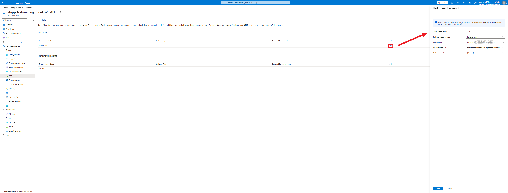
この統合を使用するには、Static Web App が **Standard** プランである必要があります。

📖 参考: [Azure Static Web Apps への独自 Function の追加](https://learn.microsoft.com/azure/static-web-apps/functions-bring-your-own)

---

### 4.6 デプロイ完了時の確認

- Function の正常性 URL が `healthy` を返します。
- Static Web App の **APIs** に、リンク済みの Function App が表示されます。
- Static Web App の URL を開くとサインイン ページが表示されます。
- GitHub リポジトリ、サービス プリンシパル、シークレット、ワークフローは作成されていません。

---

## フェーズ 5. エンドツーエンドの検証

1. `https://<swa>.azurestaticapps.net` を開き、MSAL を使用してサインインします。
2. **Todos** ページで **Generate to Test Todos**（デモ データのシード処理）を選択し、Todo が表示されることを確認します。
   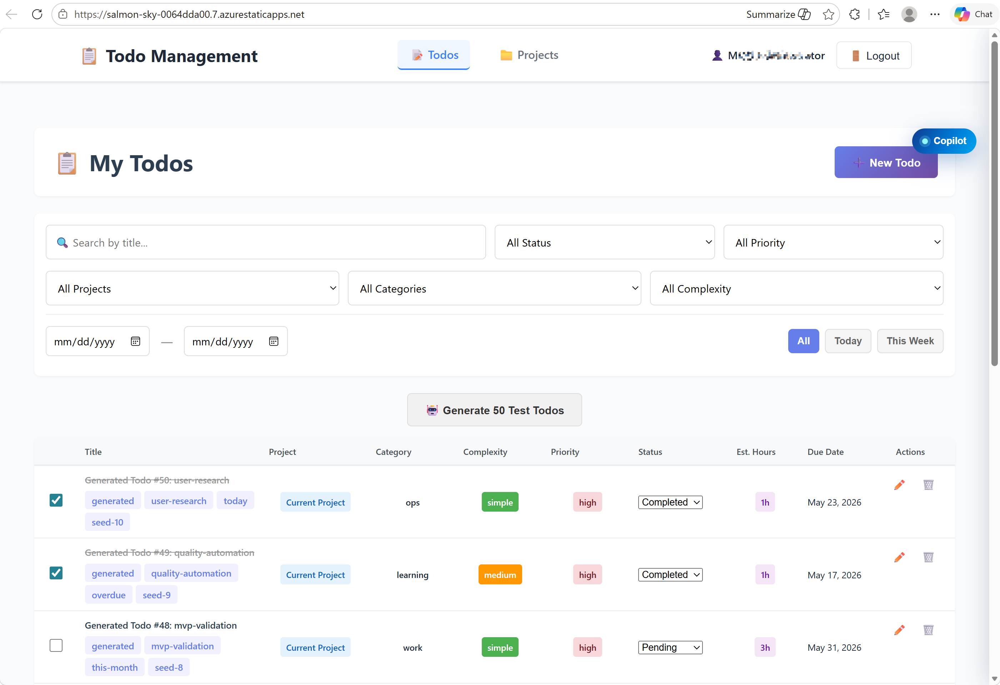
3. **Projects** でシード済みプロジェクトを開き、**View Graph** を選択して、Gremlin グラフのエッジが Cytoscape に表示されることを確認します。
   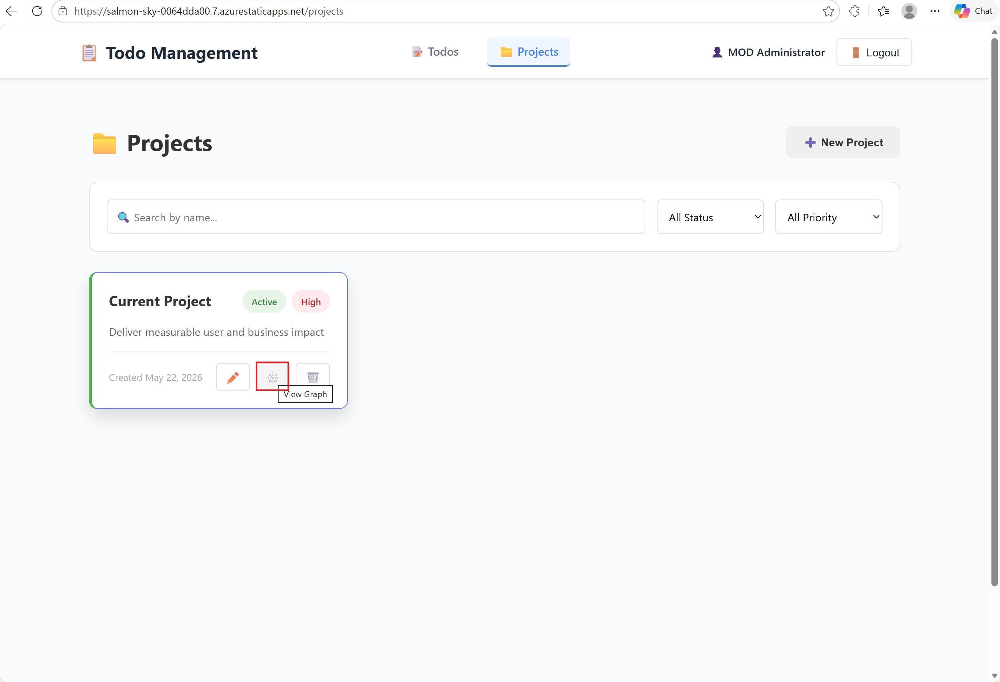
   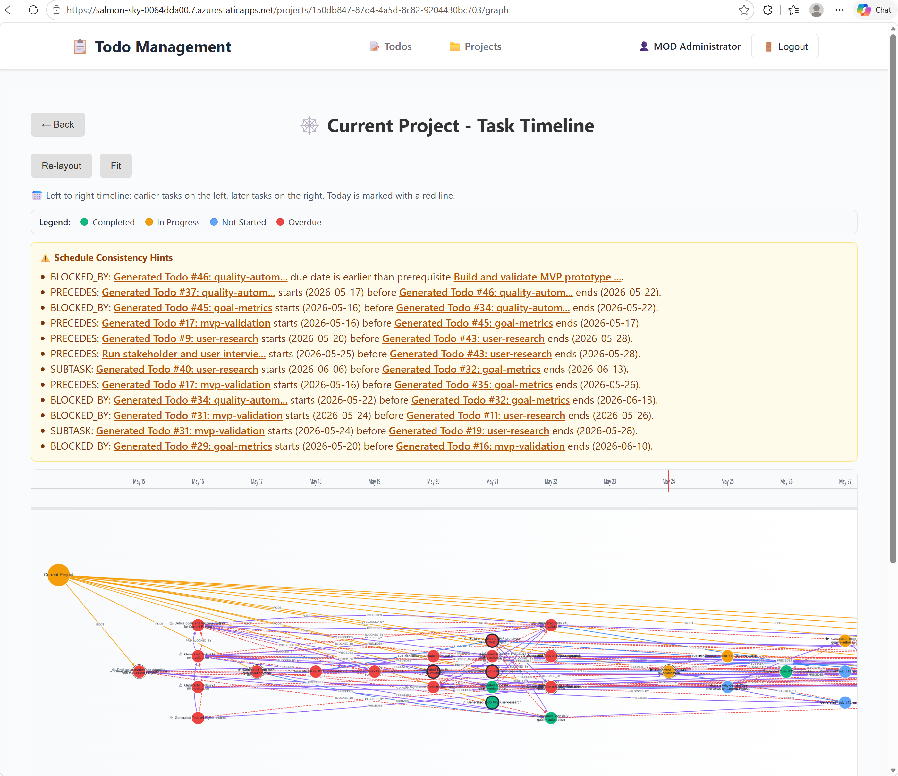
4. **Chat** で `今日、何を優先すべきですか？` などのメッセージを送信します。Foundry Agent が応答し、必要に応じて `Azure Cosmos DB` ツールを呼び出すことを確認します。
   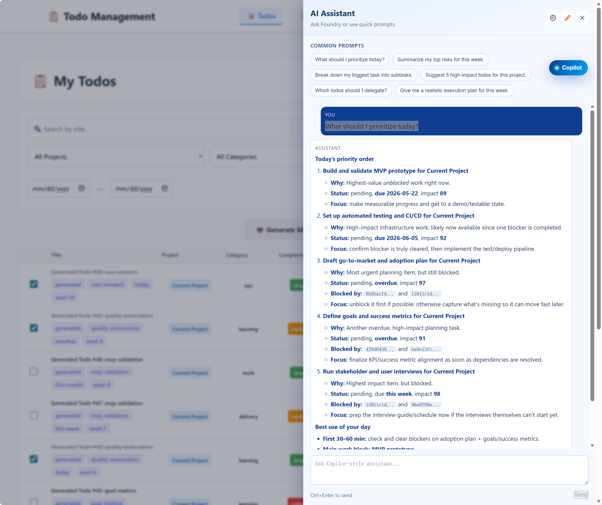
   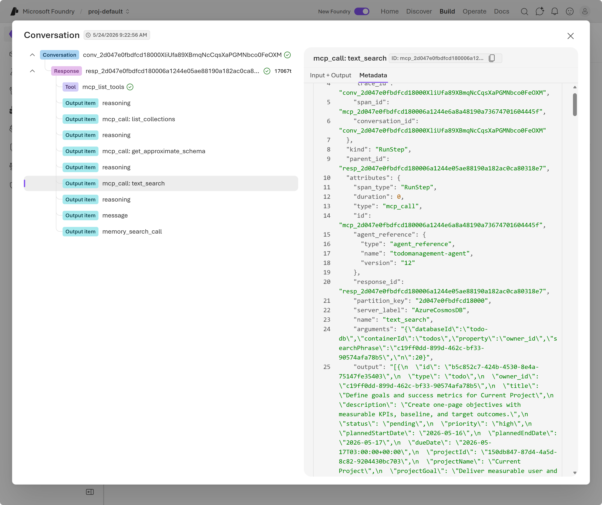

---

## フェーズ 6. クリーンアップ

```powershell
az group delete --name rg-todomanagementv2-dev --yes --no-wait
```

不要になった場合は、**Microsoft Entra ID → App registrations** で Entra ID アプリ登録（`todomanagement-spa`）を手動で削除してください。

---

## 関連ドキュメント

- [`handson/DEPLOY_GUIDE.md`](DEPLOY_GUIDE.md)
- [`docs/ARCHITECTURE_GUIDE.md`](../docs/ARCHITECTURE_GUIDE.md)
