# Todo Management v2 部署指南（Azure 门户路径）

[English](DEPLOY_GUIDE_GUI.md) | [简体中文](DEPLOY_GUIDE_GUI-zh_CN.md) | [日本語](DEPLOY_GUIDE_GUI-ja_JP.md)

本指南采用面向初学者的路径。所有 Azure 资源都通过 Azure 门户 UI 创建，纯代码步骤尽量压缩为可直接复制粘贴的操作块。若需使用 IaC 驱动的路径，请参见 [DEPLOY_GUIDE.md](DEPLOY_GUIDE.md)。

预计耗时：90 到 120 分钟。

---

## 本指南使用的术语

| 术语 | 在本次动手实验中的含义 |
| ---------------------- | ------------------------------------------------------------------------------------------------------------------------------------------- |
| **资源组** | 所有 v2 资源的逻辑容器（默认名称为 `rg-todomanagementv2-dev`）。 |
| **Function App** | 运行在 Linux Flex Consumption 计划上的 Azure Functions，用于托管 `src/api/`。 |
| **Static Web App (SWA)** | 托管基于 `src/web/` 构建的 Vue 3 SPA。 |
| **Cosmos DB Serverless** | 存储 SQL 容器（`todos` / `owners` / `projects` / `conversations`）以及 Gremlin 图（`todo-graph-db`/`todo-graph`）。 |
| **Microsoft Foundry** | 提供 `gpt-5.4-mini` 和 `text-embedding-3-small`。 |
| **应用注册** | 用于 SPA 登录的 Entra ID 标识，以及可选的服务端到 Foundry 的授权。 |
| **托管标识** | Function App 的系统分配标识，用于获取 Cosmos Gremlin 和 Azure OpenAI 的 AAD 令牌。 |

---

## 阶段 1：通过 Azure 门户创建基础设施

### 1.1 创建资源组

1. 打开 `https://portal.azure.com` 并登录。
2. 搜索 **Resource groups** → **+ Create**。
3. Subscription：选择你的订阅。**Resource group**：`rg-todomanagementv2-dev`。**Region**：`Japan East`（或任何同时支持 Cosmos + Foundry + Functions Linux + SWA 的区域）。
4. 点击 **Review + create** → **Create**。

📖 参考： [https://learn.microsoft.com/azure/azure-resource-manager/management/manage-resource-groups-portal](https://learn.microsoft.com/azure/azure-resource-manager/management/manage-resource-groups-portal)

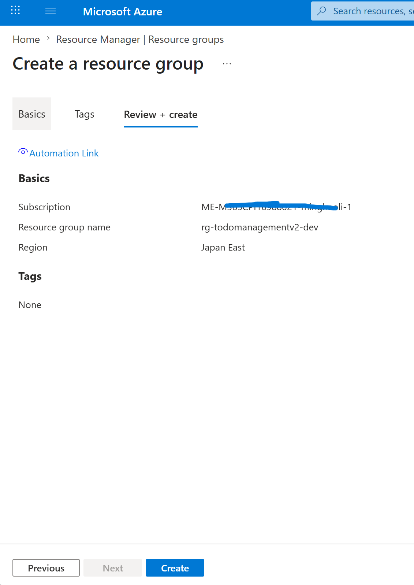

---

### 1.2 创建用于 NoSQL 的 Cosmos DB 账户

1. 搜索 **Azure Cosmos DB** → **+ Create**。
2. API：选择 **Azure Cosmos DB for NoSQL**。
3. 在 **Basics** 中填写：

   - Workload Type：`Learning`
   - Resource group：`rg-todomanagementv2-dev`
   - Account name：`cosmos-todomanagement-<unique>`（仅小写字母和数字）
   - Availability Zones：`Disable`
   - Location：与资源组相同
   - Capacity mode：**Serverless**
4. 在 **Global distribution** 中：

   - Geo-Redundancy：`Disable`
   - Multi-region Writes：`Disable`
5. 在 **Networking** 中：

   - Connectivity method：`All networks`，如有需要可后续再收紧。
6. **Backup Policy**：保持默认即可。
7. 在 **Security** 中：

   - Key-based Authentication：`Disable`，我们将使用 Entra ID 进行认证。
   - Data Encryption：`Service-managed key`
8. 点击 **Review + create** → **Create**。
   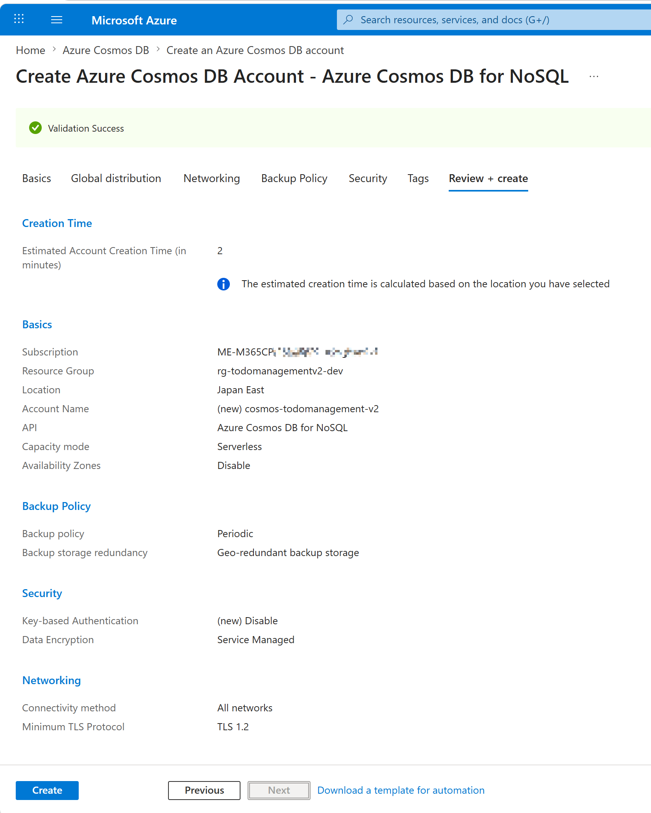
   资源创建完成后：
9. 打开该账户 → **Data Explorer** → **New Database** → ID 填写 `todo-db`。然后创建以下四个容器：

   | 容器 | 分区键 |
   | ----------------- | ------------- |
   | `todos` | `/owner_id` |
   | `owners` | `/id` |
   | `projects` | `/owner_id` |
   | `conversations` | `/owner_id` |

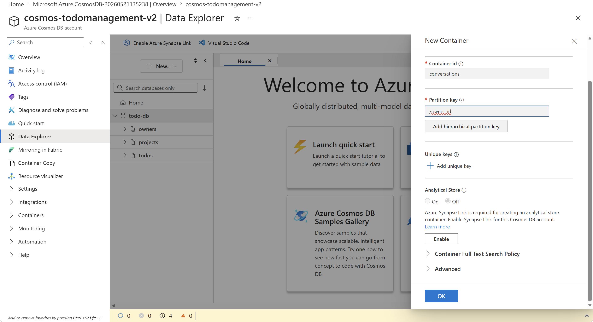
📖 参考： [https://learn.microsoft.com/azure/cosmos-db/nosql/quickstart-portal](https://learn.microsoft.com/azure/cosmos-db/nosql/quickstart-portal)

---

### 1.3 创建用于 Gremlin API 的 Azure Cosmos DB 账户

1. 搜索 **Azure Cosmos DB** → **+ Create**。
2. API：选择 **Azure Cosmos DB for Apache Gremlin**。
   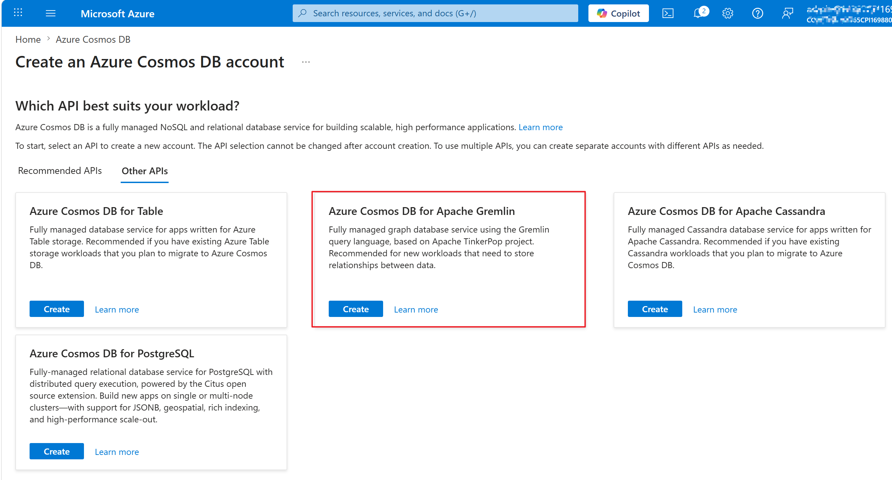
3. 在 **Basics** 中填写：

   - Workload Type：`Learning`
   - Resource group：`rg-todomanagementv2-dev`
   - Account name：`cosmosgre-todomanagement-<unique>`（仅小写字母和数字）
   - Availability Zones：`Disable`
   - Location：与资源组相同
   - Capacity mode：**Serverless**
4. 在 **Global distribution** 中：

   - Geo-Redundancy：`Disable`
   - Multi-region Writes：`Disable`
5. 在 **Networking** 中：

   - Connectivity method：`All networks`，如有需要可后续再收紧。
6. **Backup Policy**：保持默认即可。
7. 在 **Security** 中：

   - Data Encryption：`Service-managed key`
8. 点击 **Review + create** → **Create**。
   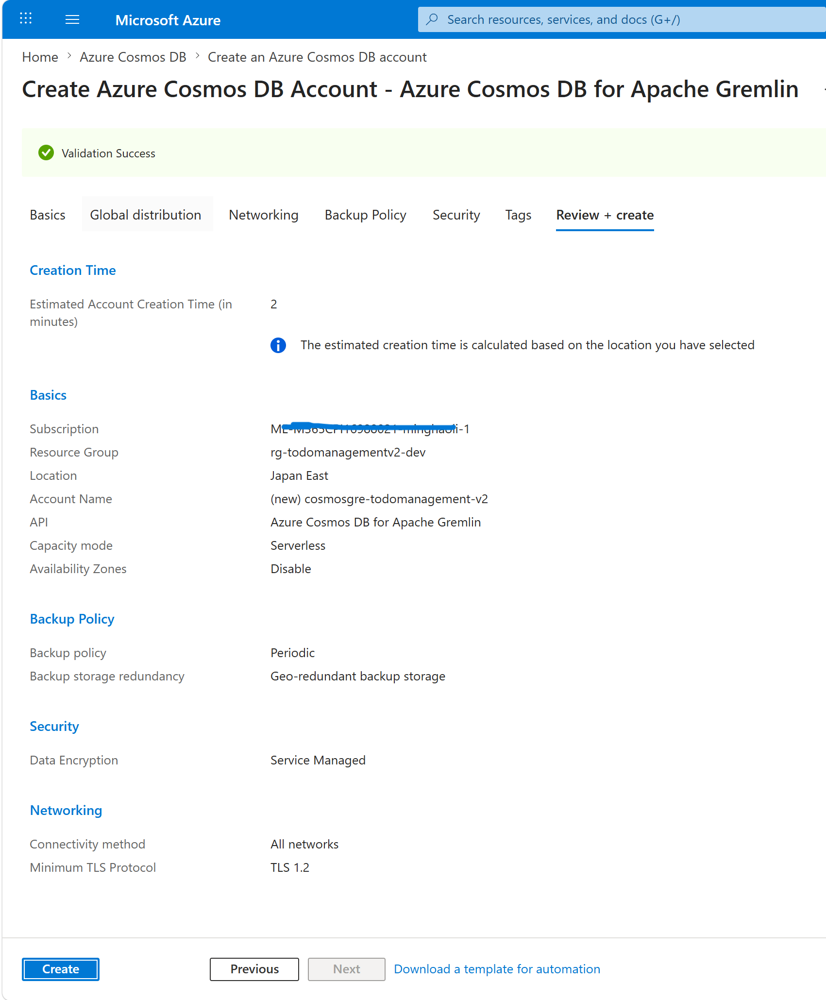
   资源创建完成后：
9. 打开该账户 → **Data Explorer** → **New Graph**：

   - **Database id**：`todo-graph-db`
   - **Graph id**：`todo-graph`
   - **Partition key**：`/owner_id`
     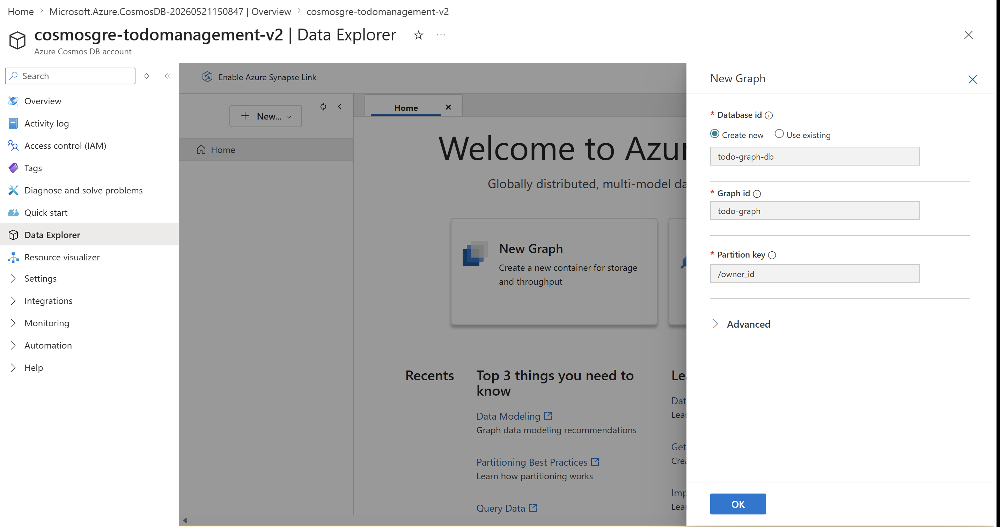

---

### 1.4 创建 Foundry 资源并部署模型

1. 搜索 **Microsoft Foundry** → **Foundry** → **+ Create**。
2. 在 **Basics** 中填写：
   - Resource group：`rg-todomanagementv2-dev`
   - Name：`foundry-todomanagement-<unique>`（仅小写字母和数字）
   - Region：与资源组相同
3. 点击 **Review + create** → **Create**。

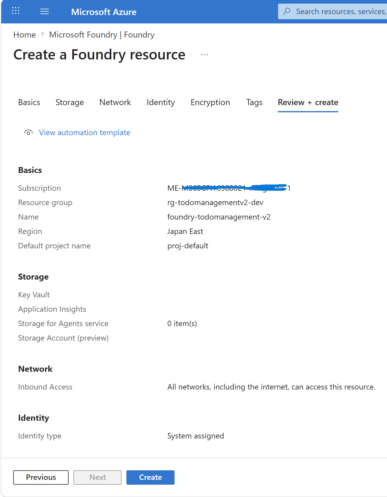
资源创建完成后：
4. 打开 Foundry 资源 → **Go to Foundry portal**，复制 `Project endpoint` 并保存。
5. 进入 **Build** → **Models** → **Deploy a base model** → 搜索 `text-embedding-3-small`
6. 选择 `text-embedding-3-small`，点击 **Deploy** → 选择 **Default settings**
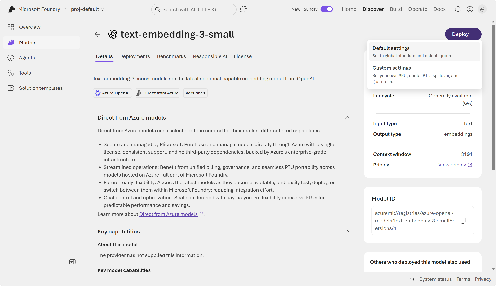
7. 进入 **Build** → **Models** → **Deploy a base model** → 搜索 `gpt-5.4-mini`
8. 选择 `gpt-5.4-mini`，点击 **Deploy** → 选择 **Default settings**
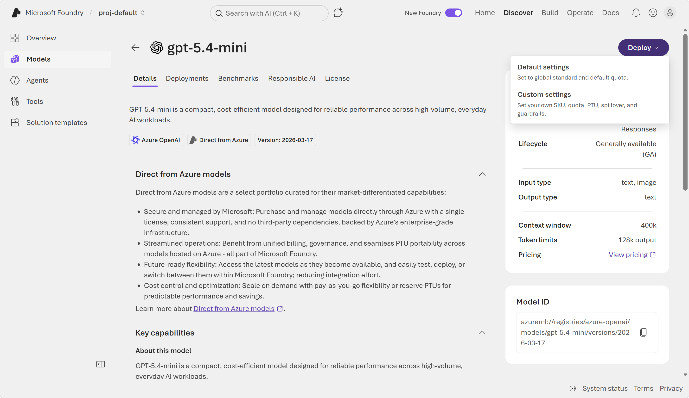

---

### 1.5 创建 Function App 和存储账户

1. 搜索 **Function App** → **+ Create**。
2. 选择 `Flex Consumption`。
3. 在 **Basics** 中填写：
   - Resource group：`rg-todomanagementv2-dev`
   - Function App name：`func-todomanagement`，并启用 **Secure unique default hostname**。
   - Region：与资源组相同
   - Runtime stack：`Python` 3.11
   - Instance size：`2048 MB`
   - Zone redundancy：`Disabled`
4. **Storage**：创建新的存储账户 `satodomanagement<unique>`（小写字母 + 数字，最长 24 个字符）。
5. **Azure OpenAI**：保持默认。
6. **Networking**：启用 Public access，不限制入站访问（后续可再收紧）。
7. **Monitoring**：启用 Application Insights，如有需要创建新的组件。
8. **Durable Functions**：保持默认。
9. **Deployment**：保持默认。
10. **Authentication**：将 Authentication type 改为 `Managed identity`。
    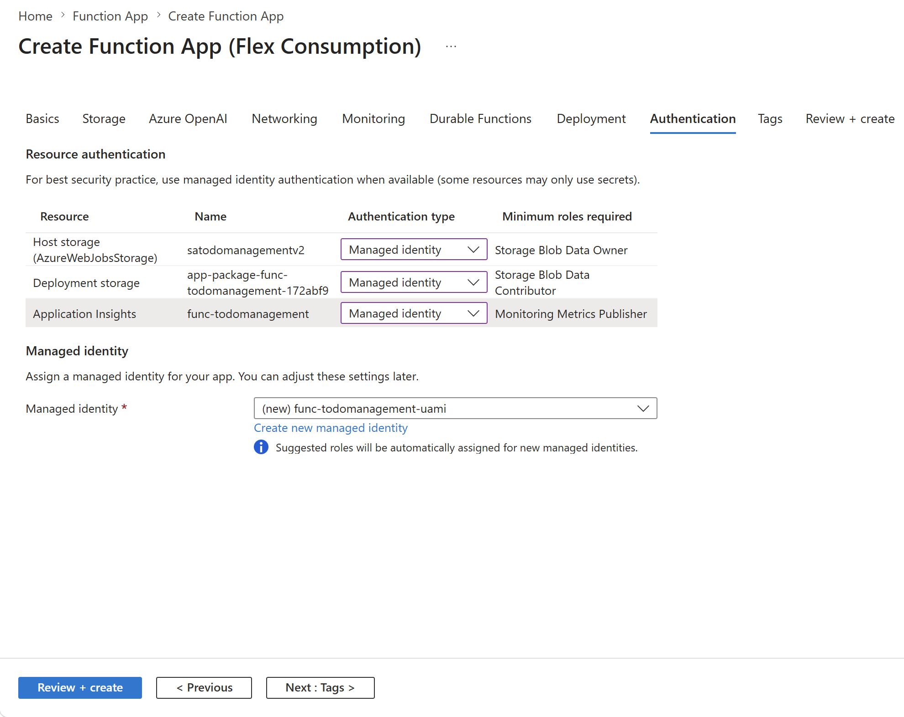
11. 点击 **Review + create** → **Create**。
    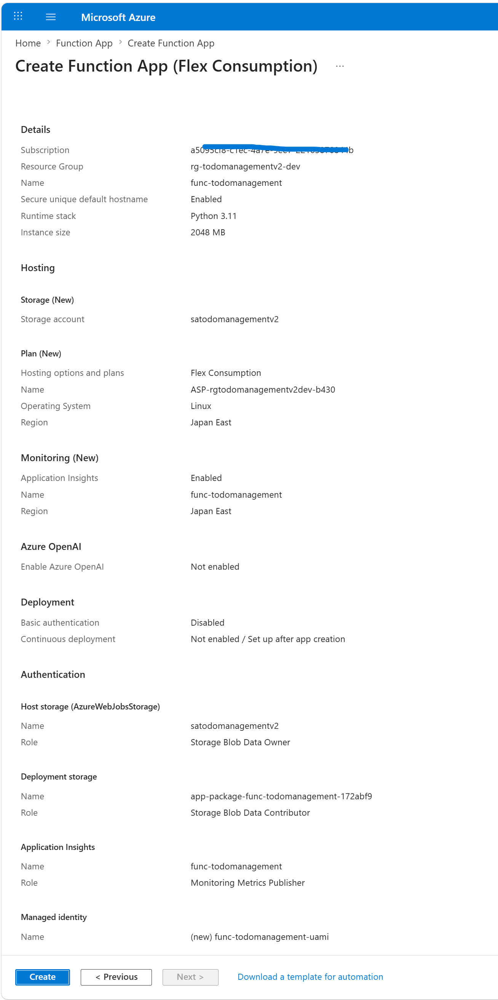
12. 资源创建完成后：打开 Function App，进入 **Settings** → **Identity** → **User assigned** → **func-todomanagement-uami**，复制 **Client Id** 和 **Object (principal) ID** 并保存。
    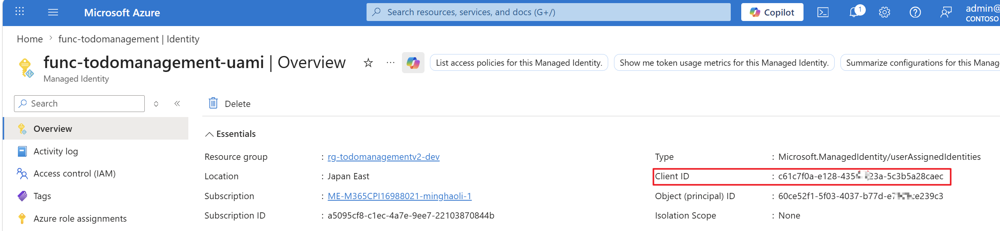

📖 参考： [https://learn.microsoft.com/azure/azure-functions/functions-create-function-app-portal](https://learn.microsoft.com/azure/azure-functions/functions-create-function-app-portal)

---

### 1.6 创建 Static Web App

1. 搜索 **Static Web Apps** → **+ Create**。
2. 在 **Basics** 中填写：
   - Resource group：`rg-todomanagementv2-dev`
   - Name：`stapp-todomanagement-<unique>`
   - Plan type：`Standard`
   - Deployment details：选择 **Other**
3. 在 **Deployment configuration** 中选择 **Deployment token**。
4. 在 **Advanced** 中，将 **Region for Azure Functions API and staging environments** 设为 `East Asia`。
5. 点击 **Review + create** → **Create**。
   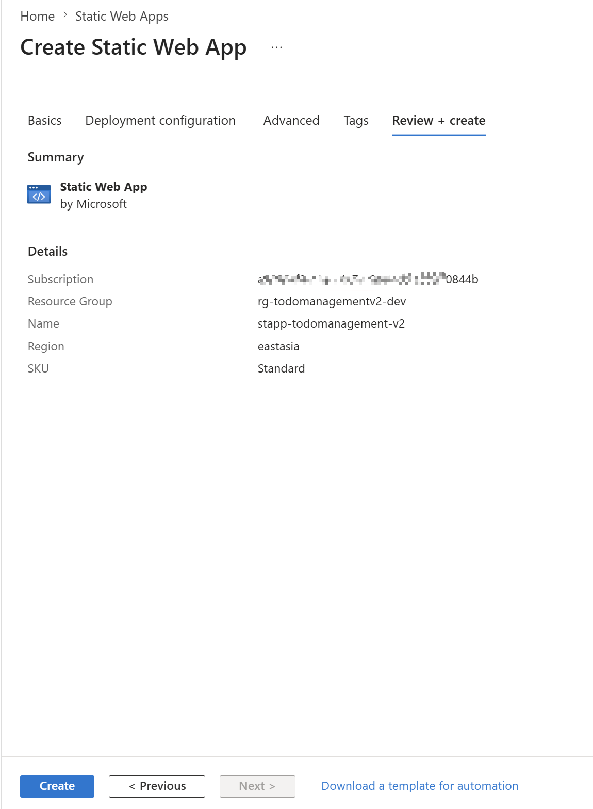
6. 资源创建完成后，打开 SWA，复制以下信息并留待第 4 阶段使用。
   - **Manage deployment token**
   - **URL**

📖 参考： [https://learn.microsoft.com/azure/static-web-apps/getting-started](https://learn.microsoft.com/azure/static-web-apps/getting-started)

---

## 阶段 2：配置身份与权限

### 2.1 在 Microsoft Entra ID 中注册 SPA

1. 搜索 **Microsoft Entra ID** → **App registrations** → **+ New registration**。
2. 名称填写：`todomanagementv2-spa`。
3. Supported account types：选择 **Accounts in this organizational directory only**。
4. Redirect URI：选择 **Single-page application (SPA)** → `https://<swa>.azurestaticapps.net/`。
5. 点击 **Register**。

创建完成后：
6. 可选。如果你希望本地运行，在 **Authentication** → **+ Add URI** 中添加 `http://localhost:5173/`，然后保存。
7. 在 **Overview** 页面复制：
   - **Application (client) ID** → 保存为 `CLIENT_ID`
   - **Directory (tenant) ID** → 保存为 `TENANT_ID`

📖 参考： [https://learn.microsoft.com/entra/identity-platform/quickstart-register-app](https://learn.microsoft.com/entra/identity-platform/quickstart-register-app)

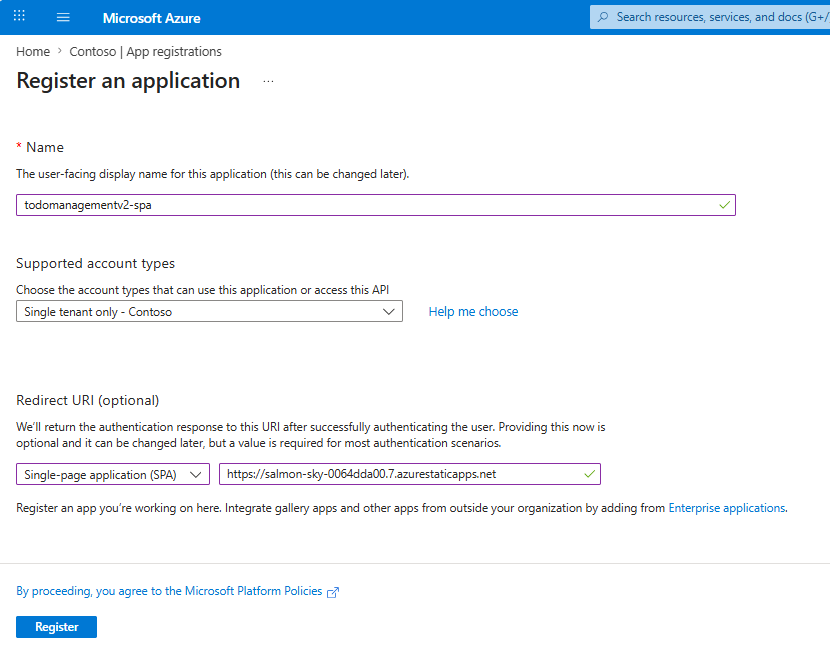

---

### 2.2 为 Function App 的托管标识授予 Cosmos、Foundry 和 Cosmos MCP Toolkit 的访问权限

1. 为 Function App 的用户分配托管标识授予 `Cosmos DB Built-in Data Contributor` 角色。
   a. 在 Azure 门户中打开 **Cloud Shell**，如果当前会话不是 PowerShell，请切换到 **PowerShell**。
   
   b. 运行以下命令：

   ```bash
   az cosmosdb sql role assignment create \
    --account-name "<your-cosmos-db-account-name>" \
    --resource-group "<your-resource-group-name>" \
    --role-definition-id "00000000-0000-0000-0000-000000000002" \
    --principal-id "<your-azure-function-uami-id>" \
    --scope "/"

   az cosmosdb sql role assignment create \
    --account-name "<your-cosmos-gremlin-db-account-name>" \
    --resource-group "<your-resource-group-name>" \
    --role-definition-id "00000000-0000-0000-0000-000000000002" \
    --principal-id "<your-azure-function-uami-id>" \
    --scope "/"
   ```

   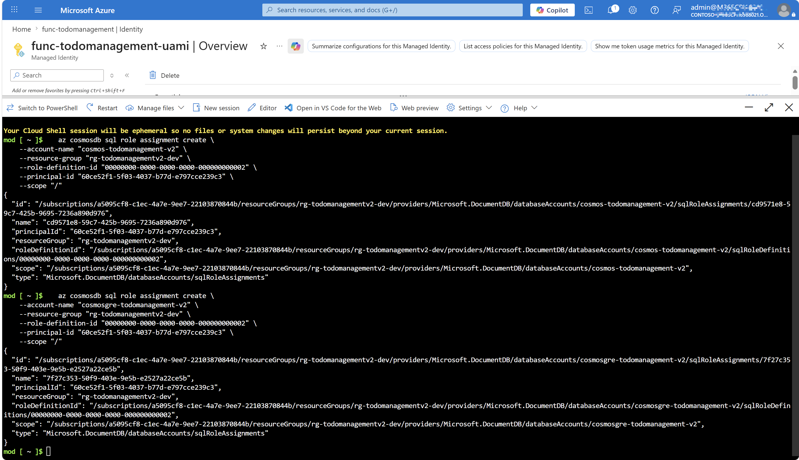
   📖 参考： [https://learn.microsoft.com/azure/cosmos-db/how-to-setup-rbac](https://learn.microsoft.com/azure/cosmos-db/how-to-setup-rbac)
2. 打开 Foundry **project** → **Access control (IAM)** → **+ Add role assignment**：

   - Role 选择 `Foundry User`
   - Assign access to：选择 **Managed identity** → 选择 **func-todomanagement-uami**。
     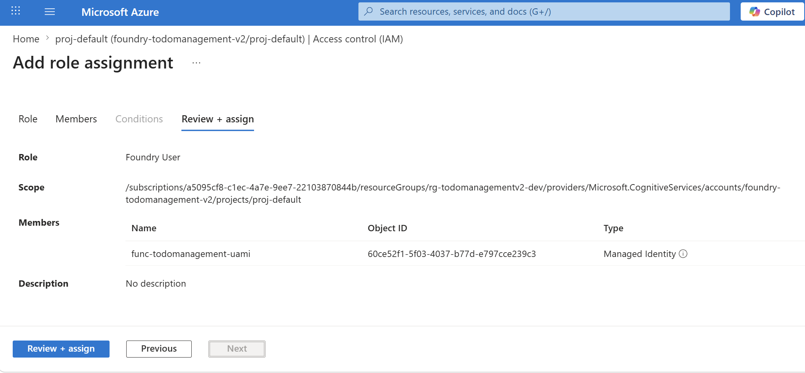
3. 为 Function App 的托管标识授予 `MCP Tool Executor` 角色。
   a. 在 Azure 门户中打开 **Cloud Shell**，如果当前会话不是 PowerShell，请切换到 **PowerShell**。
   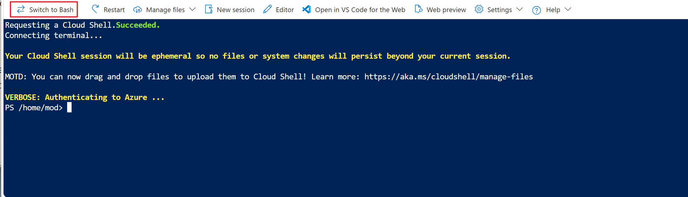
   b. 运行以下命令：

   ```powershell
   $TenantDomain = "<Specify your tenant id>"
   $ResourceName = "Azure Cosmos DB MCP Toolkit API"
   $AppRoleName = "Mcp.Tool.Executor"
   $PrincipalName = "foundry-todomanagement-v2/projects/proj-default"
   $Resource = az ad sp list --display-name $ResourceName --query "{ AppRoleId: [0] .appRoles [?value=='$AppRoleName'].id | [0], ObjectId:[0] .id }" -o json | ConvertFrom-Json

   $Principal = az ad sp list --display-name $PrincipalName --query "{ ObjectId: [0] .id }" -o json | ConvertFrom-Json


   $spObjectId = $Resource.ObjectId 
   $body = @{
      principalId = $Principal.ObjectId
      resourceId = $Resource.ObjectId 
      appRoleId = $Resource.AppRoleId
   } | ConvertTo-Json

   az rest --method POST `
      --url "https://graph.microsoft.com/v1.0/servicePrincipals/$spObjectId/appRoleAssignedTo" `
      --headers "Content-Type=application/json" `
      --body $body 2>&1

   ```

---

## 阶段 3：配置 Foundry Agent

### 3.1 为 Cosmos DB 部署 MCP 工具

1. 打开 GitHub 仓库 [https://github.com/AzureCosmosDB/MCPToolKit#option-a-deploy-to-azure-button](https://github.com/AzureCosmosDB/MCPToolKit#option-a-deploy-to-azure-button)
2. 点击 **Deploy to Azure**

   - Resource Group：`rg-todomanagementv2-dev`
   - Region：与资源组相同
   - Cosmos Endpoint：填写步骤 1.2 中创建的 Cosmos DB 账户终结点，例如 `https://cosmos-todomanagement-v2.documents.azure.com:443/`
   - Azure AI Service Endpoint：填写 Foundry 项目终结点，例如 `https://foundry-todomanagement-v2.services.ai.azure.com/api/projects/proj-default`
   - Embedding Deployment Name：`text-embedding-3-small`
3. 点击 **Review + create** → **Create**。
   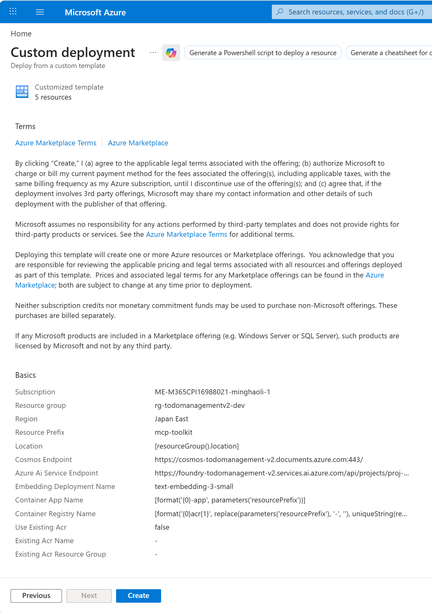
4. 部署 MCP Server 应用。
   a. 在 Azure 门户中打开 **Cloud Shell**，如果当前会话不是 PowerShell，请切换到 **PowerShell**。
   
   b. 使用以下命令克隆仓库。

   ```powershell
   git clone https://github.com/AzureCosmosDB/MCPToolKit.git
   cd MCPToolKit
   ```

   c. 修改脚本。由于我们是在 Cloud Shell 中运行 PowerShell 脚本，因此不支持 Docker。

   ```powershell
    copy ./scripts/Deploy-Cosmos-MCP-Toolkit.ps1 ./scripts/Deploy-Cosmos-MCP-Toolkit-CloudShellVersion.ps1
   ```

   点击 **Editor** 并打开 `Deploy-Cosmos-MCP-Toolkit-CloudShellVersion.ps1`。
   跳转到第 851 行，按下方内容修改。

   ```powershell
   az acr login --name $ACR_NAME --resource-group $script:ACR_RESOURCE_GROUP --expose-token
   ```

   跳转到第 870 行，注释掉 870 到 882 行。
   然后将第 870 行替换为以下命令。

   ```powershell
   az acr build -r $ACR_NAME --platform linux/amd64 -f Dockerfile.runtime . -t $IMAGE_TAG
   ```

   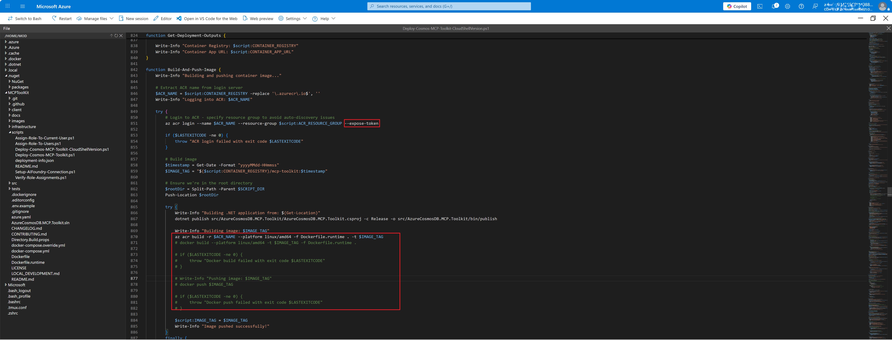

   d. 在仓库根目录运行部署脚本：

   ```powershell
   .\scripts\Deploy-Cosmos-MCP-Toolkit-CloudShellVersion.ps1 -ResourceGroup "rg-todomanagementv2-dev"
   ```

5. 测试部署结果
   a. 搜索 **Container Apps** → 点击新建的容器应用 **mcp-toolkit-app**。
   b. 点击 **Application Url**，在新标签页中打开 MCP 应用。
   c. 在 Azure 门户中打开 **Cloud Shell**，如果当前会话不是 Bash，请切换到 **Bash**。
   
   d. 执行以下命令获取 client id 和 tenant id，并保存下来。

   ```bash
   az ad app list --display-name "Azure Cosmos DB MCP Toolkit API" --query "[0].appId" -o tsv
   az account show --query "tenantId" -o tsv
   ```

   e. 在 MCP 应用中输入 client ID 和 tenant ID，然后点击 **Sign In with Microsoft Entra**。
   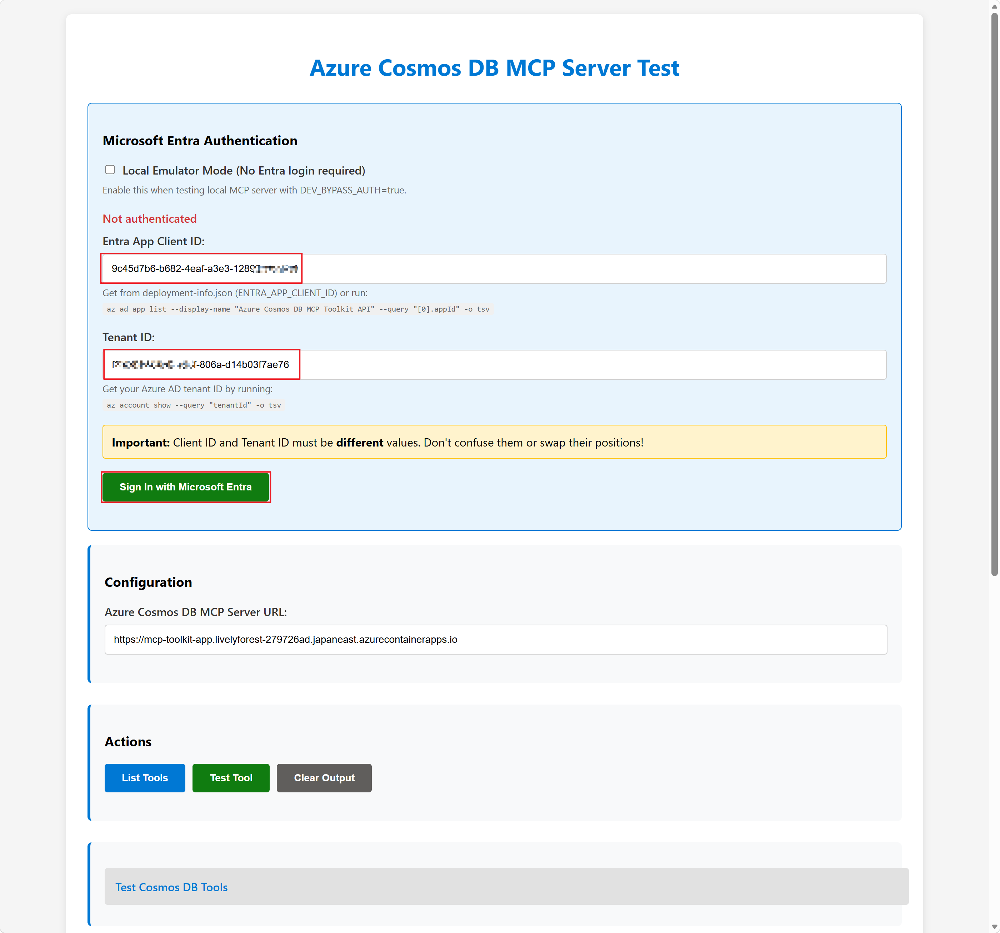
   f. 进入 **Test Tool** → 在 **Select Tool** 中选择 `List Databases` → 点击 **Invoke Selected Tool**，确认能够返回正确结果。
   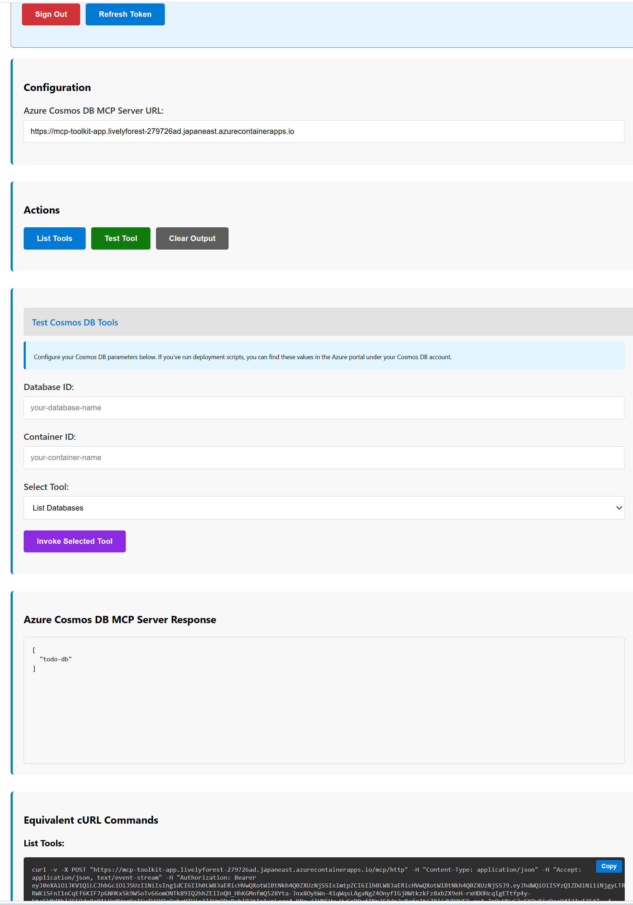

📖 参考： [https://github.com/AzureCosmosDB/MCPToolKit](https://github.com/AzureCosmosDB/MCPToolKit)

---

### 3.2 创建 Agent

1. 打开 Foundry 项目 → **Agents** → **Create agent** → 将 agent 名称设为 `todomanagement-agent` → 点击 Create。
   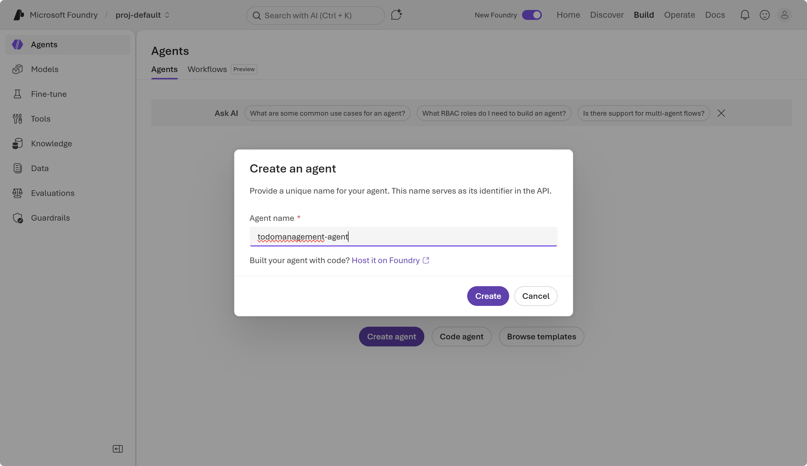
2. 填写以下信息。
   - **Model**：`gpt-5.4-mini`
   - **Instructions**：填写 [../prompt/todomanagement-agent.instructions.md](../prompt/todomanagement-agent.instructions.md) 中的内容
3. **Tools**：
   1. 移除 **Web search** 工具
   2. 添加 **Azure Cosmos DB** 工具
      a. 点击 **Add** → **Browse all tools**
      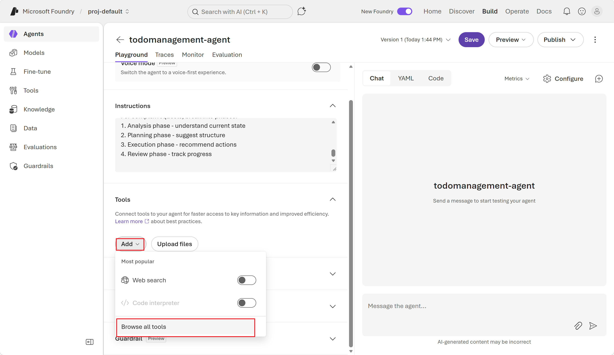
      b. 进入 **Catalog** → 搜索 `Azure Cosmos DB` → 选择该工具 → 点击 **Create**
      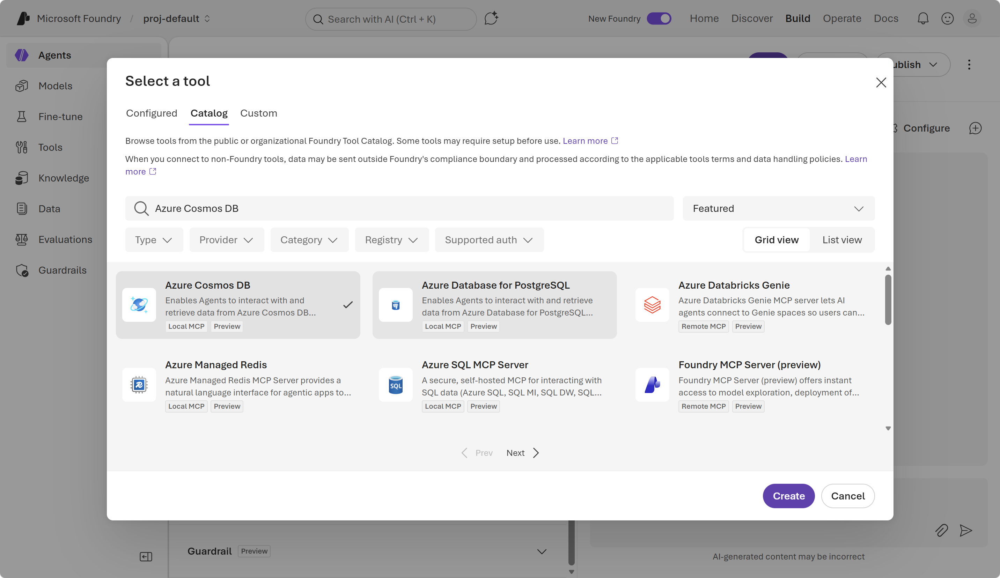
      c. **Connect tool with endpoint**
      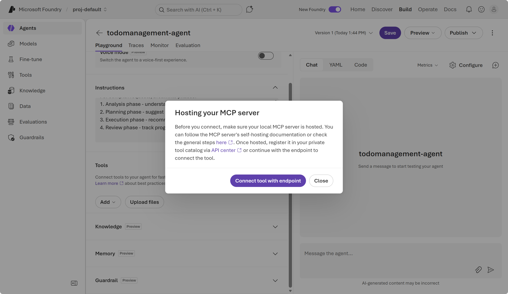
      d. 配置 Azure Cosmos DB 工具连接
      - **Name**：`AzureCosmosDB`
      - **Remote MCP Server endpoint**：`<container-application-url>/mcp`，例如 `https://mcp-toolkit-app.livelyforest-279726ad.japaneast.azurecontainerapps.io/mcp`
      - **Authentication**：`Microsoft Entra`
      - **Type**：`Project Managed Identity`
      - **Audience**：填入你的 `<entra-app-client-id>` 作为 audience。该值来自命令 `az ad app list --display-name "Azure Cosmos DB MCP Toolkit API" --query "[0].appId" -o tsv` 的输出。
        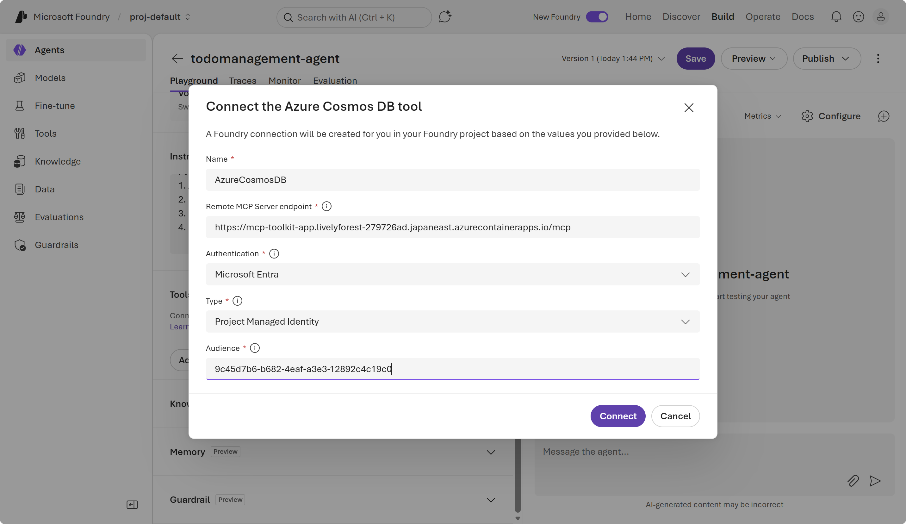
        e. 点击 **Connect**。
4. **Memory** → **Add** → **Create memory store**。
5. **Save** agent，并记下它的 **Name**（例如 `todomanagement-agent`）和 **Version**（例如 `3`）。
6. 测试 agent。
   1. 在 playground 中输入以下消息。出现工具调用请求时请批准。
      `List all databases in my Cosmos DB account`
      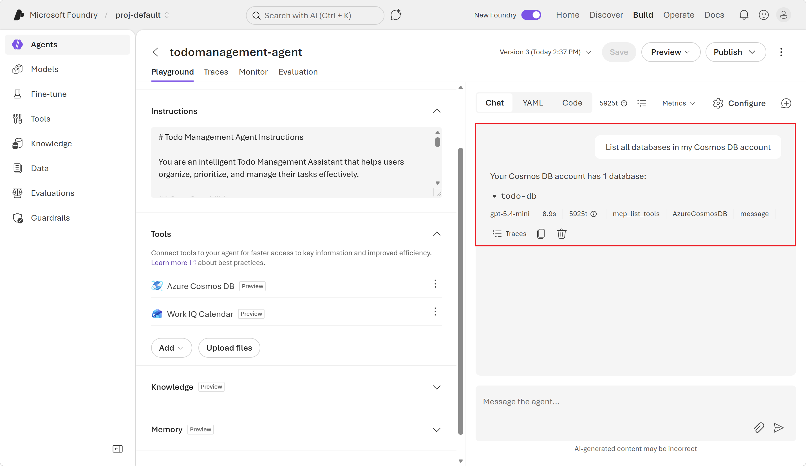
   2. 在 playground 中输入以下消息。出现工具调用请求时请批准。
      `List all meetings in my calendar`
      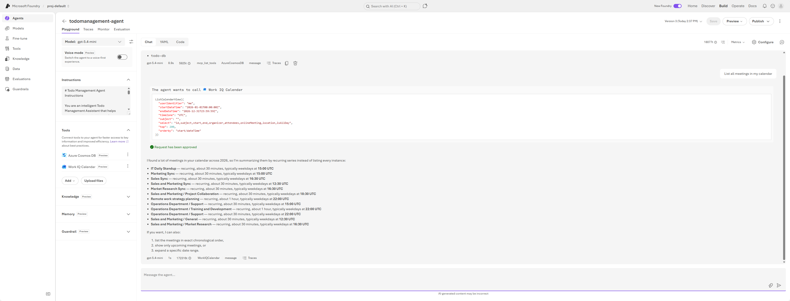
      📖 参考： [https://learn.microsoft.com/en-us/azure/foundry/agents/concepts/tool-catalog](https://learn.microsoft.com/en-us/azure/foundry/agents/concepts/tool-catalog)

---

## 阶段 4：配置并部署应用程序

### 4.1 设置 Function App 的应用配置

在 Function App 中进入 **Settings** → **Environment variables** → **+ Add**，添加以下变量：

| 名称 | 值 |
| -------------------------------- | --------------------------------------------------------------------------------------------------------- |
| `COSMOS_AUTH_MODE` | `aad` |
| `COSMOS_AUTO_CREATE` | `true` |
| `COSMOS_ENDPOINT` | `https://<cosmos>.documents.azure.com:443/`，步骤 1.2 中的终结点 |
| `COSMOS_DATABASE` | `todo-db` |
| `COSMOS_GREMLIN_ENDPOINT` | `https://<cosmos>.documents.azure.com:443/`，步骤 1.3 中的终结点 |
| `COSMOS_GRAPH_DATABASE` | `todo-graph-db` |
| `COSMOS_GRAPH_NAME` | `todo-graph` |
| `FOUNDRY_AGENT_ENDPOINT` | `https://<foundry>.services.ai.azure.com/api/projects/proj-default`，步骤 1.4 中的项目终结点 |
| `FOUNDRY_EMBEDDING_DEPLOYMENT` | `text-embedding-3-small` |
| `FOUNDRY_AGENT_NAME` | `todomanagement-agent`，步骤 3.2 中的 agent 名称 |
| `FOUNDRY_AGENT_VERSION` | 例如 `1`，步骤 3.2 中的 agent 版本 |

点击 **Apply**。

> 如果你更希望使用 Cosmos 账户密钥，可将 `COSMOS_AUTH_MODE=key`，并添加 `COSMOS_KEY=<primary key>`，以替代 RBAC 授权。

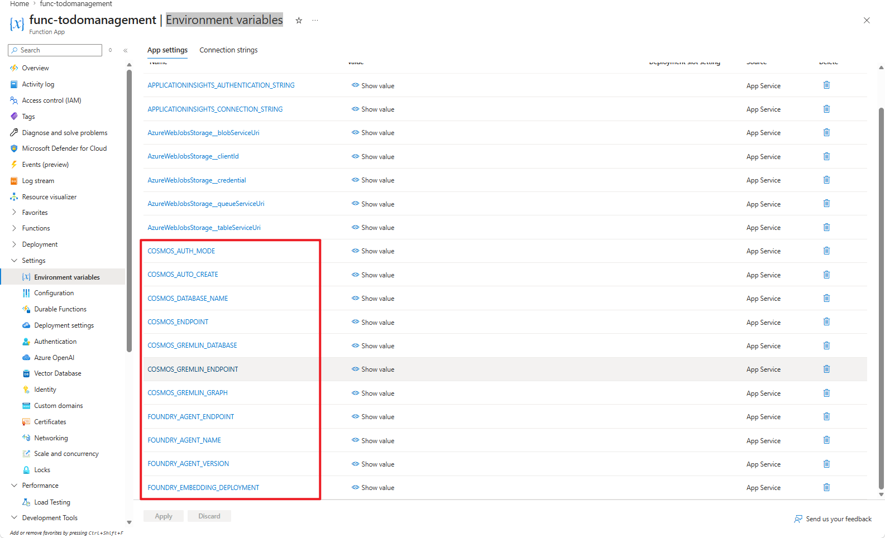

---

### 4.2 仓库准备

基于模板创建你的仓库。参见 [从模板创建仓库（GitHub Docs）](https://docs.github.com/en/repositories/creating-and-managing-repositories/creating-a-repository-from-a-template)。

1. 打开模板仓库 [https://github.com/Liminghao0922/todomanagement_v2](https://github.com/Liminghao0922/todomanagement_v2)
2. 点击 **Use this template** → **Create a new repository**
3. 设置：
   - **Repository name**：例如 `my-todo-app-v2`
   - **Visibility**：`Public`（推荐用于本工作坊流程）
4. 点击 **Create repository from template**
5. 等待仓库创建完成

---

### 4.3 GitHub Actions 配置

先配置 GitHub Actions 所需的 Azure 凭据和资源信息，再启用工作流文件，以避免初次运行时出现空跑或失败。

#### 4.3.1 创建 Azure 服务主体和凭据

参考： [Create an Azure service principal (MS Learn)](https://learn.microsoft.com/en-us/azure/developer/github/publish-docker-container)

1. 在 Azure 门户中打开 **Azure Cloud Shell**
2. 运行以下命令，创建一个作用域限定在资源组上的服务主体：

   ```powershell
   # Check current subscription
   az account show

   # Switch to a different subscription (if needed)
   # Replace `<subscription-id>` with your subscription ID from Phase 1 summary (Step 1.9).
   az account set --subscription "<subscription-id>"

   # Set variables
   $subscriptionId = $(az account show --query id -o tsv)
   $spName = "github-todomanagementv2-ci"
   # Replace with your resource group name from Phase 1 summary (Step 1.9) if you changed it.
   $resourceGroupName = "rg-todomanagementv2-dev"
   # Create service principal
   $sp = az ad sp create-for-rbac `
   --name $spName `
   --role "Owner" `
   --scopes "/subscriptions/$subscriptionId/resourceGroups/$resourceGroupName" `
   --json-auth | ConvertFrom-Json

   # Output as JSON (for later use)
   $sp | ConvertTo-Json
   ```
3. 复制 JSON 输出（完整的 `{...}` 内容）

**注意：** 这段 JSON 输出属于敏感信息，请妥善保管。

---

#### 4.3.2 添加 GitHub Actions Secret

1. 在你的 GitHub 仓库中，进入 **Settings**
2. 在左侧菜单中点击 **Secrets and variables** > **Actions** > **New repository secret**，添加以下仓库 Secret。

   | 变量 | 值 | 参考 |
   | ----------------------------------- | ------------------------------------------------------ | --------------- |
   | `AZURE_CREDENTIALS` | 应用程序凭据 JSON | 来自步骤 4.3.1 |
   | `AZURE_STATIC_WEB_APPS_API_TOKEN` | 你的 Static Web App 的 **Manage deployment token** | 来自步骤 1.6 |

 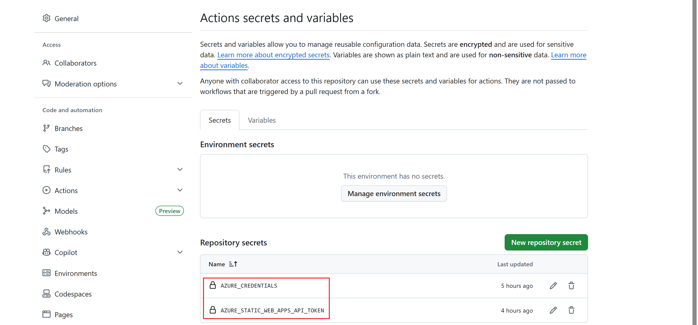

---

#### 4.3.3 添加 GitHub Repository Variables

参考： [Using variables in GitHub Actions (GitHub Docs)](https://docs.github.com/en/actions/learn-github-actions/variables)

在你的 GitHub 仓库中，进入 **Settings** > **Secrets and variables** > **Actions**，点击 **Variables**，添加以下仓库变量：

| 变量 | 值 | 参考 |
| ---------------------- | --------------------------------------------------- | ------------- |
| `AZURE_CLIENT_ID` | Entra ID 应用 Client ID | 来自步骤 2.1 |
| `AZURE_TENANT_ID` | Entra ID 租户 ID | 来自步骤 2.1 |
| `AZURE_REDIRECT_URI` | 你的 Static Web App URL | 来自步骤 1.6 |
| `FUNCTION_APP_NAME` | 你的 Function App 名称，例如 `func-todomanagement` | 来自步骤 1.5 |

---

#### 4.3.4 准备工作流文件

参考： [GitHub Actions documentation](https://docs.github.com/en/actions)

在 Secret 和变量配置完成后，再启用工作流文件。

在你的仓库中，CI/CD 工作流文件已作为模板提供：

- `.github/workflows/build-deploy-api.yml.template` → 重命名为 `build-deploy-api.yml`
- `.github/workflows/build-deploy-web.yml.template` → 重命名为 `build-deploy-web.yml`

创建这些文件的方法：

1. 在 Azure 门户中打开 **Azure Cloud Shell**
2. 运行以下命令：

```powershell
git clone <your-repo-url>
cd my-todo-app

# Copy templates without .template extension
cp .github/workflows/build-deploy-api.yml.template .github/workflows/build-deploy-api.yml
cp .github/workflows/build-deploy-web.yml.template .github/workflows/build-deploy-web.yml

# Commit and push
git add .github/workflows/*.yml
git commit -m "Enable API and Web build-deploy workflows"
git push origin main
```

---

#### 4.3.5 运行 GitHub Actions 工作流

1. 在你的仓库中进入 **Actions** 标签页
2. 你应当能看到两个工作流：
   - `Build and Deploy API to ACR`
   - `Build and Deploy Web to ACR`
3. 如果未显示工作流，请确认：
   - `.github/workflows/build-deploy-api.yml` 和 `.github/workflows/build-deploy-web.yml` 已提交到 `main`
4. 工作流会在向 `main` 分支提交代码后自动触发。
5. 点击每个工作流并观察执行状态：
   - 检查是否出现 **red X**（失败）或 **green checkmark**（成功）
   - 两个工作流通常都应在 5 到 10 分钟内完成

**工作流失败排查：**

- 检查 **AZURE_CREDENTIALS** 是否为合法 JSON
- 确认所有变量都已填写
- 检查 Azure 资源是否存在，且名称完全匹配

---

## 阶段 5：端到端验证

1. 打开 `https://<swa>.azurestaticapps.net`，并通过 MSAL 登录。
2. 在 **Todos** 页面点击 **Generate to Test Todos**（演示数据生成操作），确认 Todo 数据已生成。
   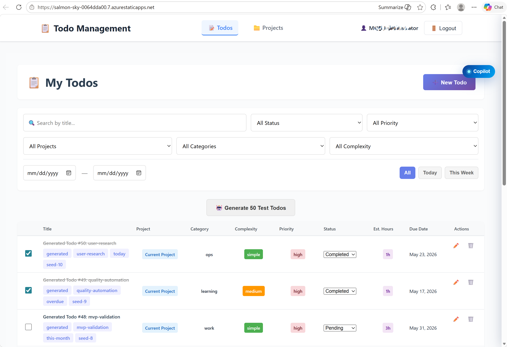
3. 打开 **Projects** → 打开一个已生成的数据项目 → 点击 **View Graph** → 确认 Cytoscape 能渲染来自 Gremlin 图的数据边。
   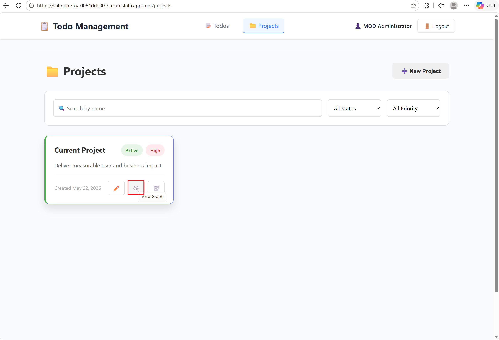
   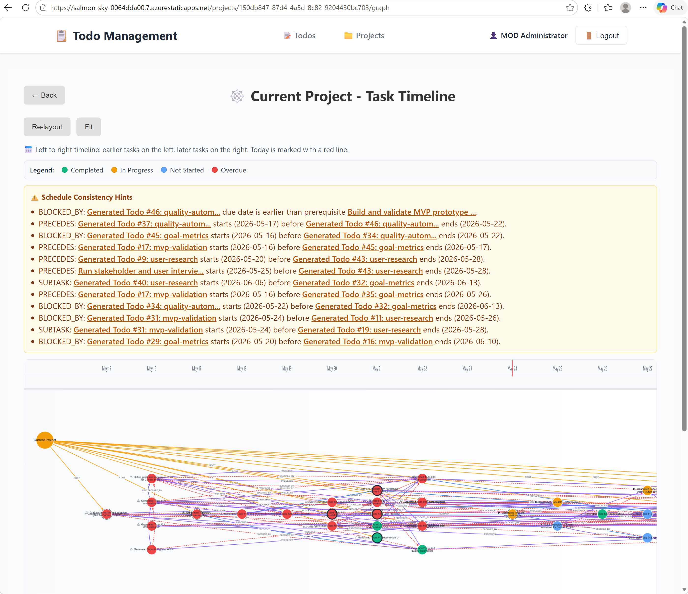
4. 打开 **Chat** → 发送消息，例如 `What should I prioritize today?` → Foundry agent 应能响应，并可能调用 `Azure Cosmos DB` 工具。
   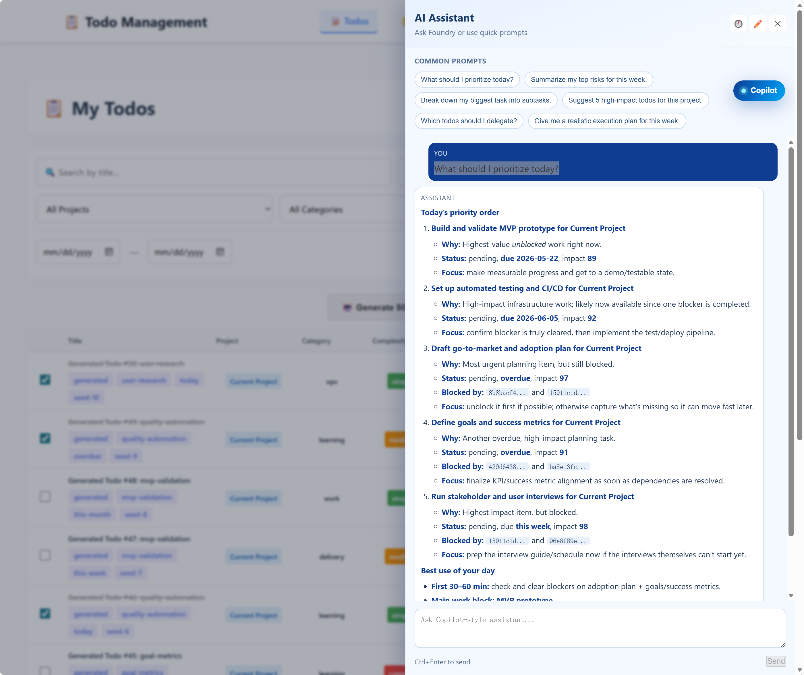
   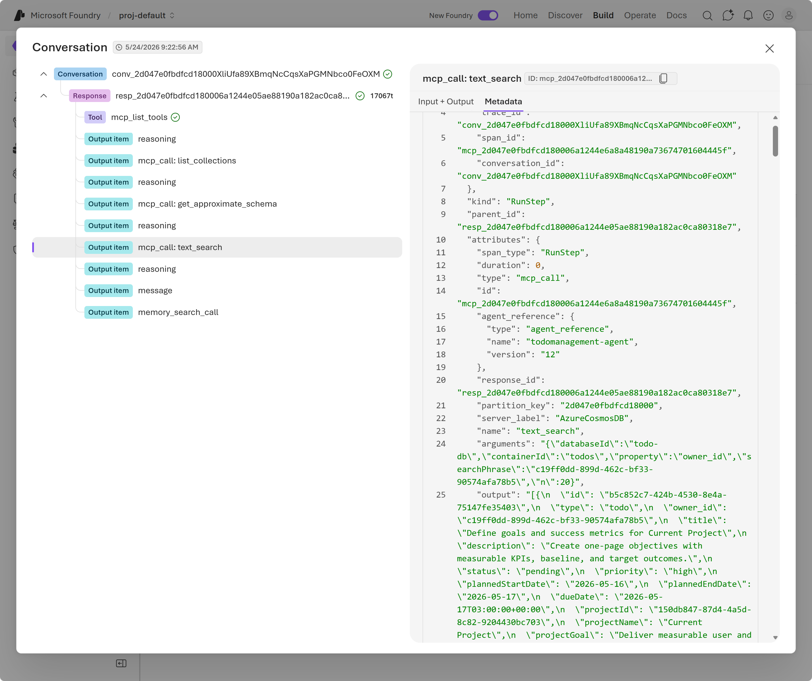

---

## 阶段 6：清理资源

```powershell
az group delete --name rg-todomanagementv2-dev --yes --no-wait
```

如果不再需要，请在 **Microsoft Entra ID → App registrations** 下手动删除 Entra ID 应用注册 `todomanagement-spa`。

---

## 相关文档

- [handson/DEPLOY_GUIDE.md](DEPLOY_GUIDE.md)
- [docs/ARCHITECTURE_GUIDE.md](../docs/ARCHITECTURE_GUIDE.md)