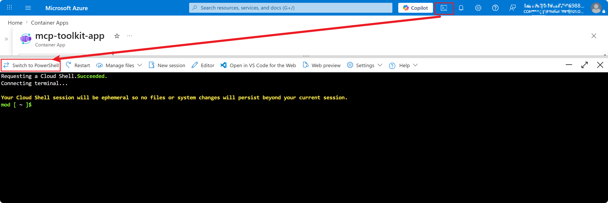
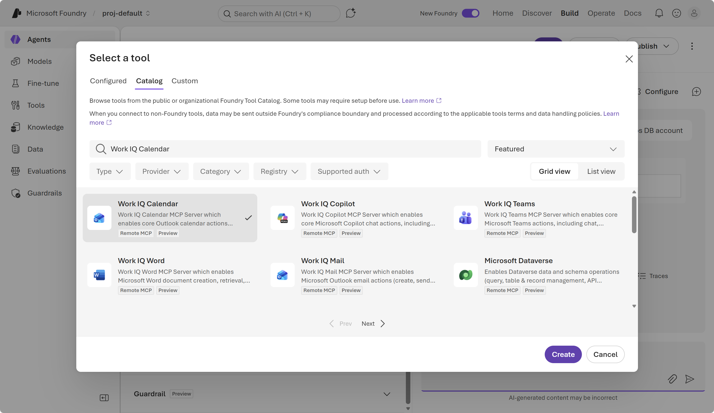
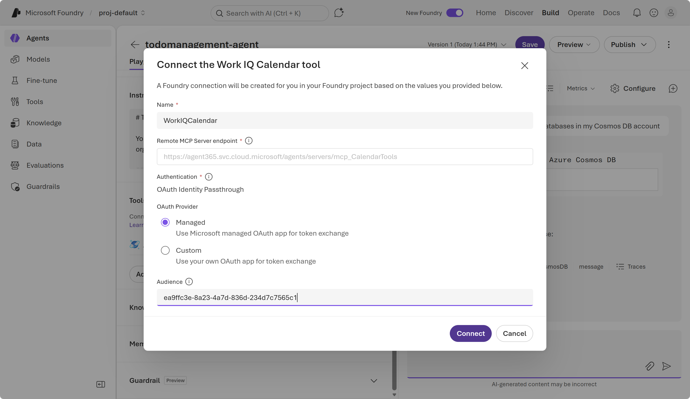

# Todo Management v2 Deployment Guide (Azure Portal track)

[English](DEPLOY_GUIDE_GUI.md) | [简体中文](DEPLOY_GUIDE_GUI-zh_CN.md) | [日本語](DEPLOY_GUIDE_GUI-ja_JP.md)

This guide is the beginner-friendly path. Every Azure resource is created from the Azure Portal UI, with code-only steps reduced to copy-paste blocks. For the IaC-driven path, see [`DEPLOY_GUIDE.md`](DEPLOY_GUIDE.md).

Estimated time: 90–120 minutes.

---

## Terminology Used in This Guide

| Term                           | Meaning in this hands-on                                                                                                                    |
| ------------------------------ | ------------------------------------------------------------------------------------------------------------------------------------------- |
| **Resource Group**       | Logical container for all v2 resources (default name `rg-todomanagementv2-dev`).                                                          |
| **Function App**         | Azure Functions on a Linux Consumption (Y1) plan that hosts `src/api/`.                                                                   |
| **Static Web App (SWA)** | Hosts the Vue 3 SPA built from `src/web/`.                                                                                                |
| **Cosmos DB serverless** | Stores SQL containers (`todos` / `owners` / `projects` / `conversations`) and the Gremlin graph (`todo-graph-db`/`todo-graph`). |
| **Microsoft Foundry**    | Provides `gpt-4o-mini` and `text-embedding-3-small`.                                                                                    |
| **App registration**     | Entra ID identity for the SPA (sign-in) and, optionally, server-to-Foundry consent.                                                         |
| **Managed identity**     | The Function App's system-assigned identity used to obtain AAD tokens for Cosmos Gremlin and Azure OpenAI.                                  |

---

## Phase 1. Create Infrastructure from Azure Portal

### 1.1 Create the resource group

1. Open `https://portal.azure.com`, sign in.
2. Search **Resource groups** → **+ Create**.
3. Subscription: your subscription. **Resource group**: `rg-todomanagementv2-dev`. **Region**: `Japan East` (or any region that supports Cosmos + Foundry + Functions Linux + SWA).
4. **Review + create** → **Create**.

📖 Reference: [https://learn.microsoft.com/azure/azure-resource-manager/management/manage-resource-groups-portal](https://learn.microsoft.com/azure/azure-resource-manager/management/manage-resource-groups-portal)


---

### 1.2 Create the Cosmos DB account for NoSQL

1. Search **Azure Cosmos DB** → **+ Create**.
2. API: **Azure Cosmos DB for NoSQL**.
3. **Basics**:

   - Workload Type: `Learning`
   - Resource group: `rg-todomanagementv2-dev`
   - Account name: `cosmos-todomanagement-<unique>` (lowercase letters / digits)
   - Availability Zones: `Disable`
   - Location: same as RG
   - Capacity mode: **Serverless**
4. **Global distribution**:

   - Geo-Redundancy: `Disable`
   - Multi-region Writes: `Disable`
5. **Networking**:

   - Connectivity method: `All networks` — restrict later if needed.
6. **Backup Policy**: defaults are fine.
7. **Security**:

   - Key-based Authentication: `Disable` - We will use Entra id for authentication.
   - Data Encryption: `Service-managed key`
8. **Review + create** → **Create**.
   
   After provisioning:
9. Open the account → **Data Explorer** → **New Database** → ID `todo-db`. Then create four containers:

   | Container                                                                                                                                            | Partition key |
   | ---------------------------------------------------------------------------------------------------------------------------------------------------- | ------------- |
   | `todos`                                                                                                                                            | `/owner_id` |
   | `owners`                                                                                                                                           | `/id`       |
   | `projects`                                                                                                                                         | `/owner_id` |
   | `conversations`                                                                                                                                    | `/owner_id` |
   |                                                                                   |               |
   | 📖 Reference:[https://learn.microsoft.com/azure/cosmos-db/nosql/quickstart-portal](https://learn.microsoft.com/azure/cosmos-db/nosql/quickstart-portal) |               |

---

### 1.3 Create an Azure Cosmos DB account for Gremlin API

1. Search **Azure Cosmos DB** → **+ Create**.
2. API: **Azure Cosmos DB for Apache Gremlin**.
   
3. **Basics**:

   - Workload Type: `Learning`
   - Resource group: `rg-todomanagementv2-dev`
   - Account name: `cosmosgre-todomanagement-<unique>` (lowercase letters / digits)
   - Availability Zones: `Disable`
   - Location: same as RG
   - Capacity mode: **Serverless**
4. **Global distribution**:

   - Geo-Redundancy: `Disable`
   - Multi-region Writes: `Disable`
5. **Networking**:

   - Connectivity method: `All networks` — restrict later if needed.
6. **Backup Policy**: defaults are fine.
7. **Security**:

   - Data Encryption: `Service-managed key`
8. **Review + create** → **Create**.
   
   After provisioning:
9. Open the account → **Data Explorer** → **New Graph**:

   - **Database id**: `todo-graph-db`
   - **Graph id**: `todo-graph`
   - **Partition key**: `/owner_id`
     

---

### 1.4 Create Foundry resource and deploy models

1. Search **Microsoft Foundry** → **Foundry** → **+ Create**.
2. **Basics**:
   - Resource group: `rg-todomanagementv2-dev`
   - Name: `foundry-todomanagement-<unique>` (lowercase letters / digits)
   - Region: same as RG
3. **Review + create** → **Create**.


After provisioning:
4. Open the foundry resource → **Go to Foundry portal**, copy the `Project endpoint` and save it.
5. **Build** → **Models** → **Deploy a base model** → search `text-embedding-3-small`
6. Select `text-embedding-3-small`, click **Deploy** → select **Default settings**

7. **Build** → **Models** → **Deploy a base model** → search `gpt-5.4-mini`
8. Select `gpt-5.4-mini`, click **Deploy** → select **Default settings**


---

### 1.5 Create the Function App + Storage

1. Search **Function App** → **+ Create**.
2. Select `Flex Consumption`
3. **Basics**:
   - Resource group: `rg-todomanagementv2-dev`
   - Function App name: `func-todomanagement`, enable **Secure unique default hostname on.**
   - Region: same as RG
   - Runtime stack: `Python` 3.11
   - Instance size: `2048 MB`
   - Zone redundancy: `Disabled`
4. **Storage**: create a new storage account `satodomanagement<unique>` (lowercase + digits, max 24 chars).
5. **Azure OpenAI**: leave it as default.
6. **Networking**: Public access enabled, no inbound restriction (tighten later).
7. **Monitoring**: enable Application Insights, create a new component if needed.
8. **Durable Functions**: leave it as default.
9. **Deployment**: leave it as default.
10. **Authentication**: change Authentication type to `Managed identity`.
    
11. **Review + create** → **Create**.
    

📖 Reference: [https://learn.microsoft.com/azure/azure-functions/functions-create-function-app-portal](https://learn.microsoft.com/azure/azure-functions/functions-create-function-app-portal)

---

### 1.6 Create the Static Web App

1. Search **Static Web Apps** → **+ Create**.
2. **Basics**:
   - Resource group: `rg-todomanagementv2-dev`
   - Name: `stapp-todomanagement-<unique>`
   - Plan type: `Standard`.
   - Deployment details: choose **Other**
3. **Deployment configuration** → choose **Deployment token** .
4. **Advanced** choose `East Asia` for **Region for Azure Functions API and staging environments**
5. **Review + create** → **Create**.
   
6. After provisioning: open the SWA → **Manage deployment token** → copy the token. Save it for Phase 4.

📖 Reference: [https://learn.microsoft.com/azure/static-web-apps/getting-started](https://learn.microsoft.com/azure/static-web-apps/getting-started)

---

## Phase 2. Configure Identity and Permissions

### 2.1 Register the SPA in Microsoft Entra ID

1. Search **Microsoft Entra ID** → **App registrations** → **+ New registration**.
2. Name: `todomanagementv2-spa`.
3. Supported account types: **Accounts in this organizational directory only**.
4. Redirect URI: **Single-page application (SPA)** → `https://<swa>.azurestaticapps.net/`.
5. **Register**.

After creation:

6. **Authentication** → **+ Add URI** → `http://localhost:5173/`. Save.
7. **API permissions** → **+ Add a permission** → Microsoft Graph → **Delegated**:
   - `User.Read`
   - `Calendars.Read`
   - **Grant admin consent** if your tenant requires it.
8. From the **Overview** page, copy:
   - **Application (client) ID** → save as `CLIENT_ID`
   - **Directory (tenant) ID** → save as `TENANT_ID`

📖 Reference: [https://learn.microsoft.com/entra/identity-platform/quickstart-register-app](https://learn.microsoft.com/entra/identity-platform/quickstart-register-app)


---

### 2.2 Grant the Function App's managed identity access to Cosmos and Foundry

1. Open the Cosmos DB account → **Access control (IAM)** → **+ Add** → **Add role assignment**:
   - Role `Cosmos DB Built-in Data Contributor`
   - Assign access to: **Managed identity** → select the Function App.
2. Open the Foundry **project** → **Access control (IAM)** → **+ Add role assignment**:
   - Role `Azure AI Developer`
   - Assign access to: **Managed identity** → select the Function App.

📖 Reference: [https://learn.microsoft.com/azure/cosmos-db/how-to-setup-rbac](https://learn.microsoft.com/azure/cosmos-db/how-to-setup-rbac)


---

## Phase 3. Configure the Foundry Agent

### 3.1 Deploy MCP tool for Cosmos DB

1. Open the GitHub Repo [https://github.com/AzureCosmosDB/MCPToolKit#option-a-deploy-to-azure-button](https://github.com/AzureCosmosDB/MCPToolKit#option-a-deploy-to-azure-button)
2. Click **Deploy to Azure**

   - Resource Group: `rg-todomanagementv2-dev`
   - Region: same as RG
   - Cosmos Endpoint: specify the Cosmos DB Account created in step2, eg: `https://cosmos-todomanagement-v2.documents.azure.com:443/`
   - Azure Ai Service Endpoint: specify the Foundry Project endpoint, eg: `https://foundry-todomanagement-v2.services.ai.azure.com/api/projects/proj-default`
   - Embedding Deployment Name: `text-embedding-3-small`
3. **Review + create** → **Create**.
   
4. Deploy MCP Server Application
   a. Open **Cloud Shell** and click **Switch to PowerShell** if the current session is not PowerShell from Azure Portal.
   
   b. Clone the repository via following command.

   ```powershell
   git clone https://github.com/AzureCosmosDB/MCPToolKit.git
   cd MCPToolKit
   ```

   c. Modify the script, as we execute the PowerShell script from Cloud Shell, the docker is not supported.

   ```powershell
    copy ./scripts/Deploy-Cosmos-MCP-Toolkit.ps1 ./scripts/Deploy-Cosmos-MCP-Toolkit-CloudShellVersion.ps1
   ```

   Click **Editor** and navigate to file `Deploy-Cosmos-MCP-Toolkit-CloudShellVersion.ps1`
   Go to line 851, change it as below.

   ```powershell
   az acr login --name $ACR_NAME --resource-group $script:ACR_RESOURCE_GROUP --expose-token
   ```

   Go to line 870, and comment out the line 870-882
   Paste the following command to line 870.

   ```powershell
   az acr build -r $ACR_NAME --platform linux/amd64 -f Dockerfile.runtime . -t $IMAGE_TAG
   ```

   

   d.Run the deployment script from the repository root:

   ```powershell
   .\scripts\Deploy-Cosmos-MCP-Toolkit-CloudShellVersion.ps1 -ResourceGroup "rg-todomanagementv2-dev"
   ```
5. Test Your Deployment
   a. Search **Container Apps** → click the new created container app **mcp-toolkit-app**.
   b. Click **Application Url** to open the MCP app in a new tab.
   c. Open **Cloud Shell** and click **Switch to Bash** if the current session is not Bash from Azure Portal.
   
   d. Execute the following command to get client id, tenant id, and save them.

   ```bash
   az ad app list --display-name "Azure Cosmos DB MCP Toolkit API" --query "[0].appId" -o tsv
   az account show --query "tenantId" -o tsv
   ```

   e. Input client id and tenant id in MCP app, click **Sign In with Microsoft Entra**.
   
   f. **Test Tool** → **Select Tool** as `List Databases`  → **Invoke Selected Tool** and make sure the correct result can be returned.
   

📖 Reference: [https://github.com/AzureCosmosDB/MCPToolKit](https://github.com/AzureCosmosDB/MCPToolKit)

---

### 3.2 Create the agent

1. Open the Foundry project → **Agents** → **Create agent** → Specify the agent name as `todomanagement-agent` → Create.
   
2. Specify the following information.
   - **Model**: (`gpt-5.4-mini`)
   - **Instructions** : Specify the content with [../prompt/todomanagement-agent.instructions.md](../prompt/todomanagement-agent.instructions.md)
3. **Tools**:
   1. Remove **Web search** tool
   2. Add **Azure Cosmos DB** tool
      a. **Add** → **Browse all tools**
      
      b. **Catalog** → search `Azure Cosmos DB` → select the tool -> **Create**
      
      c. **Connect tool with endpoint**
      
      d. **Connect the Azure Cosmos DB tool**
      - **Name**: `AzureCosmosDB`
      - **Remote MCP Server endpoint**: `<container-application-url>/mcp`, eg `https://mcp-toolkit-app.livelyforest-279726ad.japaneast.azurecontainerapps.io/mcp`.
      - **Authentication**: `Microsoft Entra`
      - **Type**: `Project Managed Identity`
      - **Audience**: Enter your `<entra-app-client-id>` as the audience. This is the value from the output for `az ad app list --display-name "Azure Cosmos DB MCP Toolkit API" --query "[0].appId" -o tsv`.
        
        e. Click **Connect**.
   3. Add **Work IQ Calendar** tool.
      a. **Add** → **Browse all tools**
      b. **Catalog** → search `Work IQ Calendar` → select the tool -> **Create**
      
      c. **Connect tool with endpoint**
      
      d. **Connect the Work IQ Calendar tool**
      - **Name**: `WorkIQCalendar`
      - **Authentication**: `Managed` OAuth Provider
        
        e. Click **Connect**.
4. **Save** the agent. Note its **Name** (e.g. `todomanagement-agent`) and **Version** (`3`).
5. Test the agent.
   1. Input the message to below in the playground. Approve the tool calling approval request when asked.
      `List all databases in my Cosmos DB account`
      
   2. Input the message to below in the playground. Approve the tool calling approval request when asked.
      `List all meetings in my calendar`
      
      📖 Reference: [https://learn.microsoft.com/en-us/azure/foundry/agents/concepts/tool-catalog](https://learn.microsoft.com/en-us/azure/foundry/agents/concepts/tool-catalog)

---

## Phase 4. Configure and Deploy the Application

### 4.1 Set the Function App application settings

In the Function App → **Settings** → **Environment variables** → **+ Add**, add the following variables:

| Name                            | Value                                                                                                       |
| ------------------------------- | ----------------------------------------------------------------------------------------------------------  |
| `COSMOS_AUTH_MODE`              | `aad`                                                                                                       |
| `COSMOS_AUTO_CREATE`            | `true`                                                                                                      |
| `COSMOS_ENDPOINT`               | `https://<cosmos>.documents.azure.com:443/`, the endpoint from step 1.2                                     |
| `COSMOS_DATABASE`               | `todo-db`                                                                                                   |
| `COSMOS_GREMLIN_ENDPOINT`       | `https://<cosmos>.documents.azure.com:443/`, the endpoint from step 1.3                                     |
| `COSMOS_GRAPH_DATABASE`         | `todo-graph-db`                                                                                             |
| `COSMOS_GRAPH_NAME`             | `todo-graph`                                                                                                |
| `FOUNDRY_AGENT_ENDPOINT`        | `https://<foundry>.services.ai.azure.com/api/projects/proj-default`, the project endpoint from step 1.4     |
| `FOUNDRY_EMBEDDING_DEPLOYMENT`  | `text-embedding-3-small`                                                                                    |
| `FOUNDRY_AGENT_NAME`            | `todomanagement-agent`, the agent name form step 3.2                                                        |
| `FOUNDRY_AGENT_VERSION`         | e.g.`1` the version from step 3.2                                                                           |

Click **Apply**.

> If you prefer to use a Cosmos account key, set `COSMOS_AUTH_MODE=key` and add `COSMOS_KEY=<primary key>` instead of granting RBAC.


---

### 4.2 Repository Setup

Create your repository from template, refer to [Creating a repository from a template (GitHub Docs)](https://docs.github.com/en/repositories/creating-and-managing-repositories/creating-a-repository-from-a-template)

1. Open the [template repository](https://github.com/Liminghao0922/todomanagement_v2)
2. Click **Use this template** -> **Create a new repository**
3. Set:
   - **Repository name**: for example `my-todo-app-v2`
   - **Visibility**: `Public` (recommended for this workshop flow)
4. Click **Create repository from template**
5. Wait for the repository to be created

---

### 4.3 GitHub Actions Configuration

Configure GitHub Actions with your Azure credentials and resource details first, then enable workflow files to avoid empty/failed initial runs.

#### 4.3.1: Create Azure Service Principal and Credentials

Reference: [Create an Azure service principal (MS Learn)](https://learn.microsoft.com/en-us/azure/developer/github/publish-docker-container)

1. Open **Azure Cloud Shell** in Azure Portal
2. Run this command to create a service principal scoped to your resource group:

   ```powershell
   # Check current subscription
   az account show

   # Switch to a different subscription (if needed)
   # Replace `<subscription-id>` with your subscription ID from Phase 1 summary (Step 1.9).
   az account set --subscription "<subscription-id>"

   # Set variables
   $subscriptionId = $(az account show --query id -o tsv)
   $spName = "github-todomanagementv2-ci"
   # Replace with your resource group name from Phase 1 summary (Step 1.9) if you changed it.
   $resourceGroupName = "rg-todomanagementv2-dev"
   # Create service principal
   $sp = az ad sp create-for-rbac `
   --name $spName `
   --role "Owner" `
   --scopes "/subscriptions/$subscriptionId/resourceGroups/$resourceGroupName" `
   --json-auth | ConvertFrom-Json

   # Output as JSON (for later use)
   $sp | ConvertTo-Json
   ```

3. Copy the JSON output (the entire `{...}` block)

**Note:** This JSON output is sensitive. Keep it secure.

---

#### 4.2.2: Add GitHub Actions Secret

1. In your GitHub repository, go to **Settings**
2. In the left menu, click **Secrets and variables** > **Actions**
3. Click **New repository secret**
4. **Name**: `AZURE_CREDENTIALS`
5. **Secret**: Paste the JSON output from Step 4.2.1
6. Click **Add secret**
   

---

### Step 3.3: Add GitHub Repository Variables

Reference: [Using variables in GitHub Actions (GitHub Docs)](https://docs.github.com/en/actions/learn-github-actions/variables)

In your GitHub repository **Settings** > **Secrets and variables** > **Actions**, click **Variables**, and add these repository variables:


| Variable                             | Value                                    | Reference     |
| ------------------------------------ | ---------------------------------------- | ------------- |
| `RESOURCE_GROUP`                     | Your resource group name                 | From Step 1.9 |
| `ACR_NAME`                           | Your ACR name (without`.azurecr.io`)     | From Step 1.9 |
| `CONTAINER_APP_ENVIRONMENT`          | Your Container Apps Environment name     | From Step 1.9 |
| `POSTGRES_SERVER`                    | Your PostgreSQL server FQDN              | From Step 1.9 |
| `POSTGRES_USER`                      | Your user-assigned managed identity name | From Step 1.9 |
| `POSTGRES_DB`                        | `tododb`                                 | Fixed value   |
| `DATABASE_TYPE`                      | `postgresql`                             | Fixed value   |
| `AZURE_CLIENT_ID`                    | Entra ID App Client ID                   | From Step 1.9 |
| `AZURE_TENANT_ID`                    | Entra ID App Tenant ID                   | From Step 1.9 |
| `USER_ASSIGNED_IDENTITY_CLIENT_ID`   | Managed Identity Client ID               | From Step 1.9 |
| `USER_ASSIGNED_IDENTITY_RESOURCE_ID` | Managed Identity Resource ID             | From Step 1.9 |
| `AZURE_REDIRECT_URI`                 | Your web Container App URL               | From Step 1.9 |
| `API_PROXY_TARGET`                   | Your internal API Container App URL      | From Step 1.9 |
| `REPOSITORY`                         | Your repository URL                      | From Step 2.1 |

---

### Step 3.4: Prepare workflow files

Reference: [GitHub Actions documentation](https://docs.github.com/en/actions)

After secrets and variables are configured, enable workflow files.

In your repository, CI/CD workflow files are provided as templates:

- `.github/workflows/build-deploy-api.yml.template` → rename to `build-deploy-api.yml`
- `.github/workflows/build-deploy-web.yml.template` → rename to `build-deploy-web.yml`

To create the files:

1. Open **Azure Cloud Shell** in Azure Portal
2. Run this command:

```powershell
git clone <your-repo-url>
cd my-todo-app

# Copy templates without .template extension
cp .github/workflows/build-deploy-api.yml.template .github/workflows/build-deploy-api.yml
cp .github/workflows/build-deploy-web.yml.template .github/workflows/build-deploy-web.yml

# Commit and push
git add .github/workflows/*.yml
git commit -m "Enable API and Web build-deploy workflows"
git push origin main
```

---

### Step 3.5: Run GitHub Actions Workflows

1. In your repository, go to the **Actions** tab
2. You should see both workflows listed:
   - `Build and Deploy API to ACR`
   - `Build and Deploy Web to ACR`
3. If workflows don't show, ensure:
   - `.github/workflows/build-deploy-api.yml` and `.github/workflows/build-deploy-web.yml` are committed to `main`
4. The workflows should trigger automatically on `main` branch commits
5. Click on each workflow and monitor:
   - Check for any **red X** (failures) or **green checkmark** (success)
   - Both should complete within 5-10 minutes each

**Troubleshooting workflow failures:**

- Check **AZURE_CREDENTIALS** is valid JSON
- Ensure all variables are filled
- Check that Azure resources exist and names match exactly

---


### 4.2 Publish the Function code from Cloud Shell

```powershell
git clone https://github.com/<your-username>/<your-repo>.git
cd <your-repo>/src/api

func azure functionapp publish func-todomanagement-<unique> --python
```

Verify:

```powershell
curl https://func-todomanagement-<unique>.azurewebsites.net/api/health
```

You should see `{"status":"healthy",...}`.


---

### 4.3 Build the SPA and deploy to SWA

Still in Cloud Shell:

```powershell
cd ../web

@"
VITE_AZURE_CLIENT_ID=<CLIENT_ID from Phase 2.1>
VITE_AZURE_AUTHORITY=https://login.microsoftonline.com/<TENANT_ID from Phase 2.1>
VITE_AZURE_REDIRECT_URI=https://<swa>.azurestaticapps.net
"@ | Out-File .env.local -Encoding utf8

npm install
npm run build

npm install -g @azure/static-web-apps-cli
swa deploy ./dist --deployment-token <SWA token from Phase 1.6> --env production
```

📖 Reference: [https://learn.microsoft.com/azure/static-web-apps/static-web-apps-cli-deploy](https://learn.microsoft.com/azure/static-web-apps/static-web-apps-cli-deploy)


---

## Phase 5. Validate End-to-End

1. Open `https://<swa>.azurestaticapps.net` and sign in via MSAL.
2. **Todos** page → **+ New todo** → fill in title and description → save.
3. Search for a todo title; vector search should rank fuzzy matches.
4. Click **Generate todos** (the demo seeding action) → verify projects + todos in Cosmos **Data Explorer**.
5. **Projects** → open a seeded project → **Project Graph** → confirm Cytoscape renders edges from the Gremlin graph.
6. **Chat** → send a message such as `Estimate the hours for "Migrate API to Functions"` → the Foundry agent should respond and possibly invoke the `estimate_hours` tool.
7. Confirm transcript persistence: in Cosmos Data Explorer, open the `conversations` container; you should see new documents partitioned by `owner_id`.


---

## Phase 6. Cleanup

```powershell
az group delete --name rg-todomanagement-dev --yes --no-wait
```

Manually delete the Entra ID app registration (`todomanagement-spa`) under **Microsoft Entra ID → App registrations** if you no longer need it.

---

## Related Docs

- [`handson/DEPLOY_GUIDE.md`](DEPLOY_GUIDE.md)
- [`handson/QUICK_REFERENCE.md`](QUICK_REFERENCE.md)
- [`handson/TROUBLESHOOTING.md`](TROUBLESHOOTING.md)
- [`docs/ARCHITECTURE_GUIDE.md`](../docs/ARCHITECTURE_GUIDE.md)
