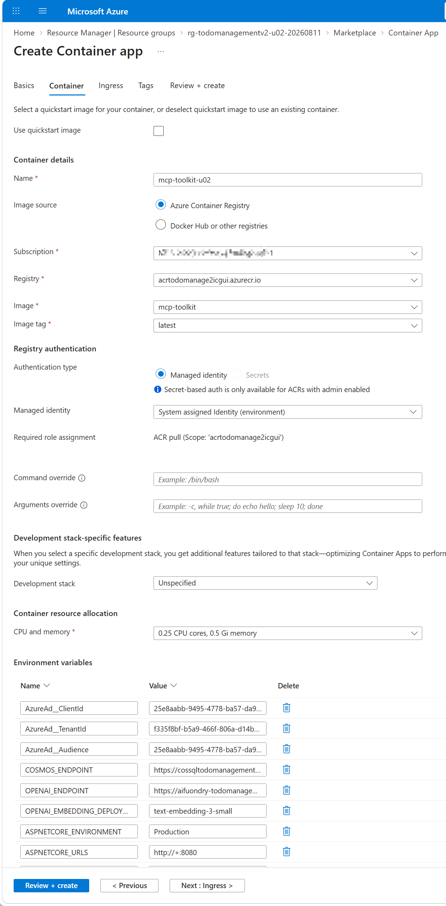
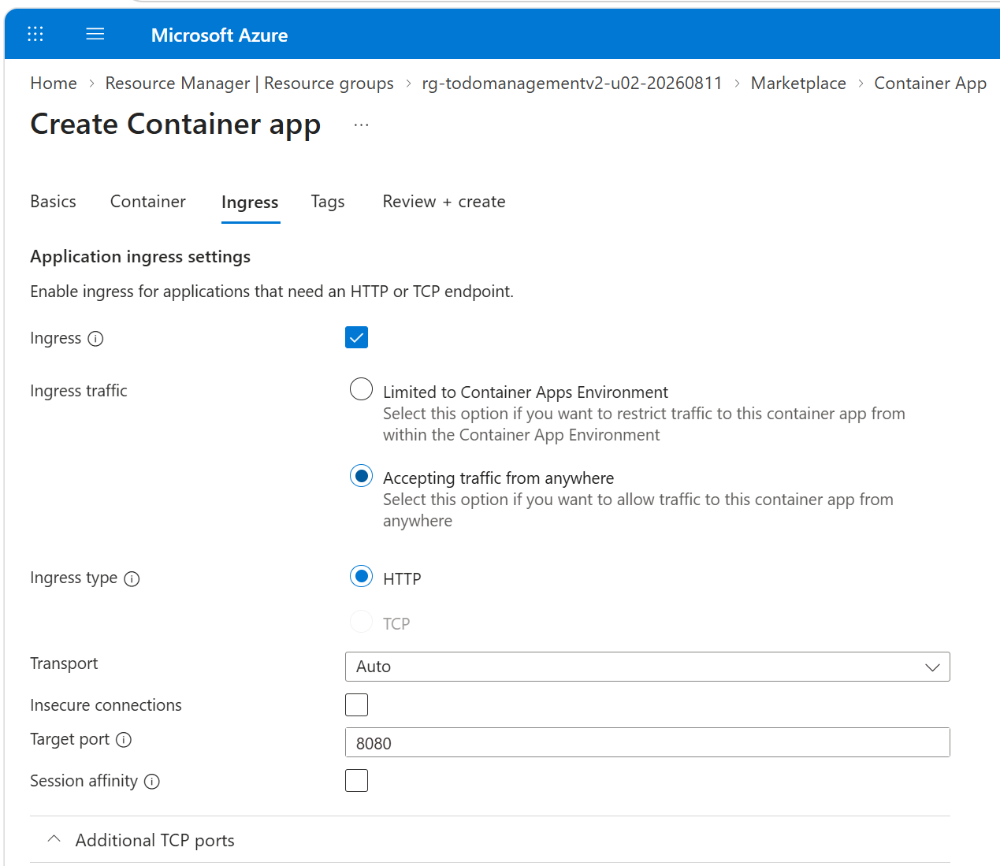
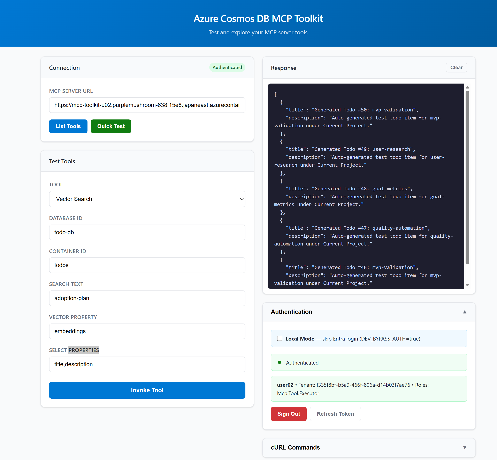
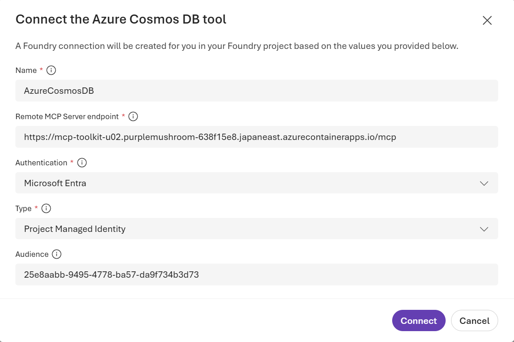
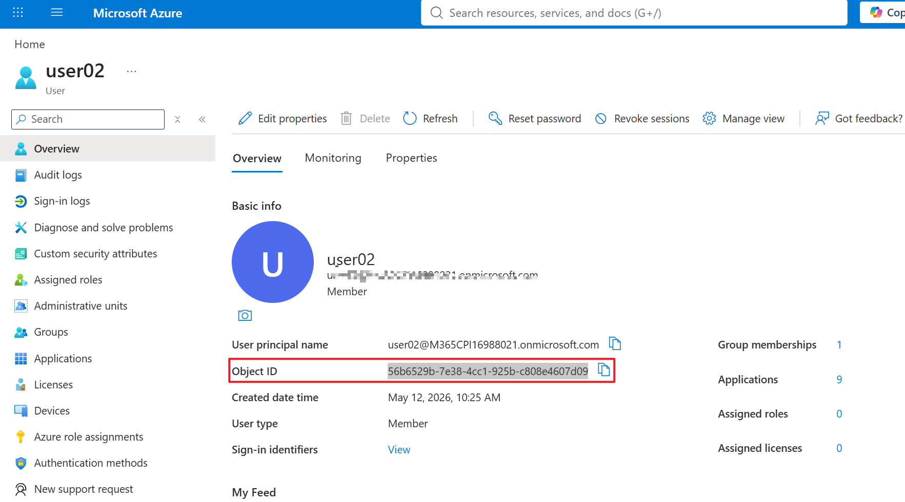
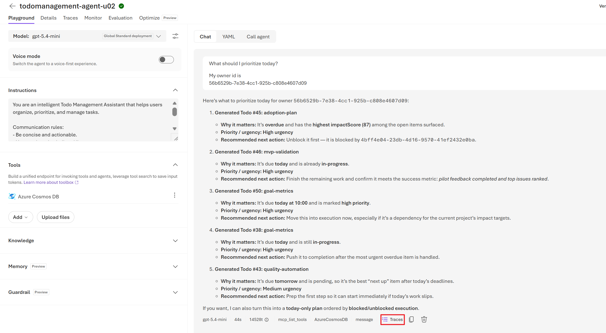

# Todo Management v2 ラボ ガイド（Foundry Focus、初級トラック）

[English](DEPLOY_GUIDE_GUI_FOUNDRY_FOCUS.md) | [简体中文](DEPLOY_GUIDE_GUI_FOUNDRY_FOCUS-zh_CN.md) | [日本語](DEPLOY_GUIDE_GUI_FOUNDRY_FOCUS-ja_JP.md)

このラボでは、受講者ごとに所有する Foundry リソース、プロジェクト、embedding と GPT モデルのデプロイ、MCP ID、Cosmos DB MCP Container App、および新しい Microsoft Foundry Prompt agent に重点を置きます。講師は授業前に、共有アプリケーション インフラストラクチャ、Container Apps 環境、コンテナー イメージを準備します。

所要時間の目安: 60–90 分。

---

## 1. 講師から必要な値とアクセス権

開始前に、次の値を記録してください。

| 項目                                | 値                                                    |
| ----------------------------------- | ----------------------------------------------------- |
| 受講者 ID                           | `<p01>`                                               |
| Tenant ID                           | `<tenant-id>`                                         |
| Todo アプリ URL                     | `<todo-app-url>`                                      |
| 受講者用リソース グループ           | `<participant-resource-group>`                        |
| Cosmos DB アカウント名              | `<cosmos-account-name>`                               |
| Cosmos DB リソース グループ         | `<cosmos-resource-group>`                             |
| Cosmos DB エンドポイント            | `https://<cosmos-account>.documents.azure.com:443/`  |
| Foundry リージョン                  | `<foundry-region>`                                    |
| ACR ログイン サーバー               | `<registry>.azurecr.io`                               |
| MCP イメージ リポジトリ             | `mcp-toolkit`                                         |
| MCP イメージ タグ                   | `<tag>`                                               |
| 割り当て済み Container Apps 環境    | `cae-todomanagement-workshop-01`                      |
| 環境リソース グループ               | `<instructor-resource-group>`                         |
| 環境リージョン                      | `japaneast`                                           |
| 割り当て済み Container App 名       | `mcp-toolkit-p01`                                     |

受講者所有の名前には、必ず受講者 ID を使用してください。

- MCP app registration: `todomanagementv2-mcp-api-p01`
- Foundry resource: `aifoundry-todomanagement-p01`
- Foundry project: `proj-todomanagement-p01`
- Embedding deployment: `text-embedding-3-small-p01`
- Foundry connection: `AzureCosmosDB-p01`
- Foundry agent: `todomanagement-agent-p01`

他の受講者の ID は使用しないでください。また、別の Container Apps 環境を作成しないでください。

必要なアクセス権:

- 受講者用リソース グループに対する Contributor または Owner。
- 割り当て済み Container Apps 環境に対する Container Apps Contributor。
- 講師提供の Cosmos DB アカウントに対する DocumentDB Account Contributor。
- 割り当て済み環境のシステム ID を通じて、講師提供 ACR イメージを使用する権限。
- app registration を作成する権限。Enterprise Application ロールを割り当てられない場合は、講師にロール割り当てを依頼してください。

Cloud Shell PowerShell は、Cosmos DB データ プレーン ロール割り当てにのみ使用します。

---

## 開始前: Todo データを生成する

Foundry リソースを作成する前に、受講者アカウントに紐づく Todo データを初期化してください。

1. 講師から提供された `TODO_APP_URL` をプライベート ブラウザー ウィンドウで開きます。
2. 割り当てられた受講者アカウントでサインインします。
3. **Todos** ページを開きます。
4. **Generate 50 Test Todos** を 1 回選択します。
5. 処理完了を待ち、生成された Todo 項目がページに表示されることを確認します。

チェックポイント:

- 受講者アカウントで Todo アプリにサインインできること。
- 生成された Todo 項目が **Todos** ページに表示されること。

---

## 2. Foundry リソースとプロジェクトを作成する

### 2.1 Foundry リソースを作成する

1. [Azure portal](https://portal.azure.com) を開きます。
2. 検索バーで **Foundry** を検索し、**Use with Foundry** の下にある **Foundry** を開きます。
3. **+ Create** を選択します。
4. **Basics** で次のように設定します。

   - Subscription: 講師提供のワークショップ サブスクリプション。
   - Resource group: 受講者用リソース グループ。
   - Resource name: `aifoundry-todomanagement-p01`（`p01` を受講者 ID に置き換え）。名前はグローバルに一意である必要があります。
   - Region: 講師提供の Foundry リージョン（例: **Japan East**）。
5. 別途指示がない限り、残りのタブは講師提供の既定値のままにします。
6. **Review + create** -> **Create** を選択します。
7. デプロイが成功するまで待ち、**Go to resource** を選択します。
8. Azure portal の `FOUNDRY_RESOURCE_NAME` の **Overview** ページで、**Go to Foundry portal** を選択します。
9. **Home** を開き、次を記録します。

   - Project endpoint を `FOUNDRY_PROJECT_ENDPOINT` として記録。
   - `/openai/v1` を除いた Azure OpenAI endpoint を `AZURE_OPENAI_ENDPOINT` として記録（例: `https://aifuondry-todomanagement-p01.openai.azure.com`）。

### 2.2 Foundry User 権限を割り当てる

1. [Azure portal](https://portal.azure.com) に戻ります。
2. セクション 2.1 で作成した `FOUNDRY_RESOURCE_NAME` を開きます。
3. **Access control (IAM)** -> **+ Add** -> **Add role assignment** を開きます。
4. **Role** で **Foundry User** を検索して選択し、**Next** を選択します。
5. **Members** で以下を設定します。
   - Assign access to: **User, group, or service principal**。
   - **+ Select members** を選択します。
   - 受講者アカウントを検索して選択します。
6. **Review + assign** を選択し、もう一度 **Review + assign** を選択します。
7. **Access control (IAM)** -> **Role assignments** を開き、受講者アカウントに **This resource** スコープで **Foundry User** が付与されていることを確認します。

**Add role assignment** が表示されない場合は、講師に依頼して `FOUNDRY_RESOURCE_NAME` 上で受講者アカウントへ **Foundry User** を割り当ててもらってください。Contributor 権限だけではロール割り当てを作成できません。この操作には Owner、User Access Administrator、または同等の権限が必要です。

チェックポイント:

- 受講者アカウントが **Role assignments** に **Foundry User** ロールで表示されること。
- スコープがサブスクリプションや講師リソースではなく、受講者専用 Foundry リソースであること。

---

## 3. モデルをデプロイする

### 3.1 `text-embedding-3-small` をデプロイする

1. Foundry プロジェクトで **Build** -> **Deployments** を開きます。
2. **Deploy a base model** を選択します。
3. `text-embedding-3-small` を検索して選択します。
4. **Deploy** -> **Default settings** を選択します。
5. デプロイ名を `EMBEDDING_DEPLOYMENT_NAME` として記録します。

### 3.2 `gpt-5.4-mini` をデプロイする

1. **Build** -> **Deployments** で **Deploy a base model** を選択します。
2. `gpt-5.4-mini` を検索して選択します。
3. **Deploy** -> **Default settings** を選択します。
4. デプロイ状態が **Succeeded** になるまで待ちます。
5. デプロイ名を `GPT_DEPLOYMENT_NAME` として記録します。

---

## 4. MCP API ID と Container App を作成する

### 4.1 App Registration を作成する

1. Azure portal を開きます。
2. **Microsoft Entra ID** -> **App registrations** を開きます。
3. **+ New registration** を選択します。
4. 次を入力します。
   - Name: `todomanagementv2-mcp-api-p01`（`p01` を受講者 ID に置き換え）。
   - Supported account types: **Accounts in this organizational directory only**。
   - Redirect URI: いったん空欄のままにします。
5. **Register** を選択します。
6. **Overview** で次を記録します。
   - **Application (client) ID** を `MCP_CLIENT_ID` として記録。
   - **Directory (tenant) ID** を `TENANT_ID` として記録。

### 4.2 MCP API を公開する

1. **Expose an API** を開きます。
2. **Application ID URI** の横にある **Add** を選択します。
3. `api://<MCP_CLIENT_ID>` を承認して保存します。
4. **+ Add a scope** を選択します。
5. 次を入力します。
   - Scope name: `access_as_user`
   - Who can consent: **Admins and users**
   - Admin consent display name: `Access Cosmos DB MCP Toolkit API`
   - Admin consent description: `Allow access to the Cosmos DB MCP Toolkit API on behalf of the signed-in user.`
   - User consent display name: `Access Cosmos DB MCP Toolkit API`
   - User consent description: `Allow access to the Cosmos DB MCP Toolkit API on your behalf.`
   - State: **Enabled**
6. **Add scope** を選択します。

### 4.3 MCP Tool Executor App Role を作成する

1. **App roles** を開きます。
2. **+ Create app role** を選択します。
3. 次の値を入力します。

   | Setting | Value |
   | --- | --- |
   | Display name | `MCP Tool Executor` |
   | Allowed member types | **Both (Users/Groups + Applications)** |
   | Value | `Mcp.Tool.Executor` |
   | Description | `Execute Cosmos DB MCP tools` |
   | Enable this app role | Checked |

4. **Apply** を選択します。

### 4.4 委任 API 権限を追加する

1. **API permissions** を開きます。
2. **+ Add a permission** -> **My APIs** を選択します。
3. `todomanagementv2-mcp-api-p01` アプリを選択します。
4. **Delegated permissions** -> `access_as_user` -> **Add permissions** を選択します。
5. テナントで管理者同意が必要な場合は、講師に **Grant admin consent** の実行を依頼してください。

チェックポイント:

- Application ID URI が `api://<MCP_CLIENT_ID>` であること。
- 委任スコープ `access_as_user` が存在すること。
- App role `Mcp.Tool.Executor` がユーザーとアプリケーションの両方を許可していること。

---

プライベート ACR イメージの pull には、割り当て済み Container Apps 環境ですでに有効化されている system-assigned identity を使用します。Container App 自体の system-assigned identity は、Cosmos DB と Foundry のランタイム アクセス用に別途有効化します。

### 4.5 MCP イメージで Container App を作成する

1. Azure portal で **Container Apps** を検索します。
2. **+ Create** -> **Container App** を選択します。
3. **Basics** で次を入力します。

   - Resource group: 受講者用リソース グループ。
   - Container app name: 割り当てられた一意の名前（例: `mcp-toolkit-p01`）。
   - Region: 講師提供の環境リージョン。
   - Container Apps environment: 講師により割り当てられた環境を選択。
4. **Container** で次を設定します。

   - **Use quickstart image** のチェックを外す。
   - Image source: **Azure Container Registry**
   - Registry: 講師提供の ACR
   - Image: 講師提供の `mcp-toolkit` リポジトリ
   - Image tag: 講師提供のタグ
   - Authentication type: **Managed identity**
   - Managed identity: 割り当て済み Container Apps 環境の **System assigned** を選択
   - CPU: `0.5`
   - Memory: `1 GiB`
5. 次の環境変数を追加します。

   | Name                            | Value                                  |
   | ------------------------------- | -------------------------------------- |
   | `AzureAd__ClientId` | `MCP_CLIENT_ID` |
   | `AzureAd__TenantId` | `TENANT_ID` |
   | `AzureAd__Audience` | `MCP_CLIENT_ID` |
   | `COSMOS_ENDPOINT` | 講師提供の Cosmos DB エンドポイント |
   | `OPENAI_ENDPOINT` | `AZURE_OPENAI_ENDPOINT` |
   | `OPENAI_EMBEDDING_DEPLOYMENT` | `EMBEDDING_DEPLOYMENT_NAME` |
   | `ASPNETCORE_ENVIRONMENT` | `Production` |
   | `ASPNETCORE_URLS` | `http://+:8080` |

   
6. **Ingress** で次を設定します。

   - Ingress: **Enabled**
   - Ingress traffic: **Accepting traffic from anywhere**
   - Ingress type: **HTTP**
   - Target port: `8080`

   
7. **Review + create** -> **Create** を選択します。
8. リビジョンが **Running** と表示されるまで待ちます。
9. Container App の **Application URL** を `MCP_APP_URL` としてコピーします。

割り当て済み環境が選択できない場合は、作業を停止し、Container Apps Contributor の割り当てを講師に確認してもらってください。代替環境は作成しないでください。

プライベート イメージを pull できない場合は、環境の system identity に `AcrPull` があること、およびレジストリ認証で **System assigned** が選択されていることを確認してください。

### 4.6 Container App の Managed Identity を有効化する

1. Container App を開きます。
2. **Settings** -> **Identity** -> **System assigned** を開きます。
3. **Status** を **On** にして **Save** を選択します。
4. **Object (principal) ID** を `MCP_PRINCIPAL_ID` として記録します。

### 4.7 ID に Cosmos DB へのアクセス権を付与する

まず、コントロール プレーンの reader ロールを付与します。

1. 講師提供の Cosmos DB for NoSQL アカウントを開きます。
2. **Access control (IAM)** -> **+ Add role assignment** を開きます。
3. **Cosmos DB Account Reader Role** を選択します。
4. Container App の system-assigned managed identity に割り当てます。

次に Azure Cloud Shell を開き、**PowerShell** を選択します。以下を実行してください。

```powershell
$cosmosResourceGroup = "<cosmos-resource-group>"
$cosmosAccountName = "<cosmos-account-name>"
$cosmosAccountId = az cosmosdb show `
   --resource-group $cosmosResourceGroup `
   --name $cosmosAccountName `
   --query id `
   --output tsv

$mcpPrincipalId = "<MCP_PRINCIPAL_ID>"

az cosmosdb sql role assignment create `
  --resource-group $cosmosResourceGroup `
  --account-name $cosmosAccountName `
  --role-definition-id "00000000-0000-0000-0000-000000000001" `
  --principal-id $mcpPrincipalId `
  --scope $cosmosAccountId
```

`0001` で終わる role ID は **Cosmos DB Built-in Data Reader** です。

### 4.8 ID に Foundry へのアクセス権を付与する

1. Azure portal で、受講者専用の Foundry resource を開きます。
2. **Access control (IAM)** -> **+ Add role assignment** を開きます。
3. **Foundry User** を選択します。
4. Container App の system-assigned managed identity に割り当てます。
5. **Access control (IAM)** -> **Role assignments** を開き、**This resource** スコープで `MCP_PRINCIPAL_ID` にロールが割り当てられていることを確認します。
6. Azure RBAC の反映のため、テスト前に少なくとも 5 分待ちます。

`Foundry User` には、埋め込み生成に必要な Foundry および Azure OpenAI データ プレーン権限が含まれます。このラボでは追加の推論ロールを付与しないでください。

### 4.9 Redirect URI を構成する

1. **Microsoft Entra ID** -> **App registrations** を開き、MCP app registration を選択します。
2. **Authentication** を開きます。
3. **+ Add a platform** -> **Single-page application** を選択します。
4. 次の Redirect URI を追加します。
   - `https://<your-container-app-hostname>/`
5. 構成を保存します。

### 4.10 MCP Tool Executor を割り当てる

まず、ユーザーにロールを割り当てます。

1. **Microsoft Entra ID** -> **Enterprise applications** を開きます。
2. `todomanagementv2-mcp-api-p01` アプリケーションを見つけます。
3. **Users and groups** -> **+ Add user/group** を開きます。
4. ユーザーと **MCP Tool Executor** ロールを選択します。
5. 割り当てを完了します。

次に、同じロールを Foundry プロジェクトの managed identity に割り当てます。

1. 同じ Enterprise Application で **+ Add user/group** を選択します。
2. `<foundry-account-name>/projects/<project-name>` という名前の managed identity を選択します。
3. **MCP Tool Executor** ロールを選択し、割り当てを完了します。

ポータルでプロジェクト managed identity を選択できない場合は、講師にこの割り当てを依頼してください。この Entra 権限は Azure サブスクリプション RBAC とは別です。

### 4.11 MCP Toolkit を直接テストする

1. `MCP_APP_URL` をプライベート ブラウザー ウィンドウで開きます。
2. 求められた場合は `MCP_CLIENT_ID` と `TENANT_ID` を入力します。
3. サインインします。
4. **Test Tool** を開きます。
5. **List Databases** を選択して実行します。
6. **Vector Search** を選択し、次を入力します。
   - Database: `todo-db`
   - Container: `todos`
   - Search text: `adoption-plan`
   - Vector Property: `embeddings`
   - Select Properties: `title,description`
7. ツールを実行します。


期待される結果:

- **List Databases** が `todo-db` を返すこと。
- **Vector Search** が `401 Unauthorized` なしで一致する Todo 項目を返すこと。

**List Databases** は成功するものの **Vector Search** が `401 Unauthorized` を返す場合は、まず `OPENAI_ENDPOINT` が `/api/projects/` を含む Project endpoint ではなく、Azure OpenAI endpoint `https://<your-foundry-resource>.openai.azure.com/` を使用していることを確認してください。次に、Container App の system identity に **Foundry User** があることを確認し、RBAC 反映を待ってから Container App を再起動し、再テストしてください。

直接の MCP テストが両方とも成功するまで、先に進まないでください。

---

## 5. 新しい Foundry Prompt Agent を作成する

### 5.1 受講者ごとに一意な Agent を作成する

1. Microsoft Foundry portal の受講者専用プロジェクトに戻ります。
2. **Build** -> **Agents** を開きます。
3. **New agent** -> **Build an agent** を選択します。
4. agent 名として `todomanagement-agent-p01` を入力し、`p01` を受講者 ID に置き換えます。
5. セクション 3.2 で記録した `GPT_DEPLOYMENT_NAME` のモデル デプロイを選択します。

### 5.2 Agent Instructions を入力する

以下を **Instructions** にそのまま貼り付けます。

```text
You are an intelligent Todo Management Assistant that helps users organize, prioritize, and manage tasks.

Communication rules:
- Be concise and actionable.
- Use numbered or bulleted lists.
- Ask a focused clarifying question only when a required identifier is missing.
- Ground answers in tool results rather than generic productivity advice.

Cosmos DB data:
- Database: todo-db
- Containers: todos, projects, owners, conversations
- Always preserve owner_id boundaries when reading or changing data.

Tool-first rules:
- For requests such as "What should I prioritize today?", "What should I work on next?", "Which todos should I delegate?", or "Summarize my top risks", call the Cosmos DB MCP tool before answering.
- Query incomplete todos first.
- Query related projects when project context is required.
- Rank tasks by overdue/today/this-week urgency, then impactScore, then priority.
- Prefer incomplete work unless the user explicitly requests a retrospective.
- If no matching data exists, state that clearly and ask one focused follow-up question.

When suggesting tasks, return:
1. Task title
2. Why it matters
3. Priority or urgency
4. Recommended next action
```

### 5.3 Azure Cosmos DB MCP Tool を追加する

1. agent editor で、自動追加されている場合は **Web search** を削除します。
2. **Add** -> **Browse all tools** を選択します。
3. **Azure Cosmos DB** を検索して選択します。
4. 次の値を使用して新しい connection を作成します。

   | Setting | Value |
   | --- | --- |
   | Connection name | 受講者 ID を使って `AzureCosmosDB-p01` を設定 |
   | Remote MCP Server endpoint | `https://<your-container-app-hostname>/mcp` |
   | Authentication | **Microsoft Entra** |
   | Authentication type | **Project Managed Identity** |
   | Audience | `MCP_CLIENT_ID` |


5. **Connect** を選択します。
6. agent の tool 一覧に表示されることを確認します。
7. agent を保存し、新しいバージョンが **Running** または **Active** であることを確認します。

受講者所有のプロジェクトと Container App に対応づけやすいよう、connection 名は一意にしてください。

### 5.4 Agent をテストする

次のプロンプトを順に実行します。

1. `List all databases in my Cosmos DB account.`
2. `List containers in database todo-db.`
3. `What should I prioritize today?`

期待される挙動:

- Agent が受講者専用の Azure Cosmos DB MCP tool を呼び出すこと。
- 最初の応答に `todo-db` が表示されること。
- tool 結果がモデル単独の知識ではなく Cosmos DB から取得されること。
- 優先順位付けの応答で、tool が返した具体的な Todo を根拠として示すこと。
- プロンプト 3 実行時に `owner_id` の入力を求められる場合があります。Azure portal で **Microsoft Entra ID** を開き、ユーザー プリンシパル名 (UPN) を検索し、アカウントを選択して **Overview** ページから **Object ID** をコピーしてください。


Foundry が tool 承認を要求した場合は、tool 名と引数を確認してから呼び出しを承認してください。

---

## 6. Traces を確認し、Instructions を調整する

### 6.1 Trace を確認する

1. agent 会話の **Traces** を開きます。

2. 最終回答が tool 結果に基づいていることを確認します。

### 6.2 Instructions を調整する

次の制約を Agent instructions に追加します。

```text
For prioritization requests, return exactly five items in a Markdown table with columns Rank, Todo, Reason, and Next action.
```

**Save** をクリックして新しい Agent バージョンを作成し、同じプロンプトを再実行して次を比較します。

- 同じ tool が呼び出されるか
- tool 引数が変更されたか
- 出力形式が改善したか
- 回答が Cosmos DB データに基づいたままか

---

## 7. 完了条件

次をすべて満たしたらラボ完了です。

- MCP API app registration に `access_as_user` と `Mcp.Tool.Executor` があること。
- 受講者専用の Foundry resource と project が受講者用リソース グループに存在すること。
- 受講者専用 `text-embedding-3-small` デプロイが成功していること。
- `gpt-5.4-mini` デプロイが成功していること。
- Container App が、managed identity 認証で講師提供 MCP イメージを実行していること。
- 直接の **List Databases** テストで `todo-db` が返ること。
- 新しい Prompt agent が受講者ごとに一意な名前と connection を持つこと。
- Agent が Cosmos DB MCP を正常に呼び出せること。
- プロンプトから tool 呼び出し、最終応答までの trace を 1 件説明できること。
- instruction 変更を 1 回以上保存し、比較したこと。

---

## 8. トラブルシューティング

| 症状                                                             | 確認事項                                                                                                                                                   |
| ---------------------------------------------------------------- | ---------------------------------------------------------------------------------------------------------------------------------------------------------- |
| Foundry resource を作成できない | 受講者用リソース グループでの Contributor または Owner 権限と、`Microsoft.CognitiveServices` provider 登録を確認してください。 |
| Foundry project を作成できない | 受講者専用 Foundry resource が正常にデプロイ済みであり、選択されていることを確認してください。 |
| Embedding デプロイに失敗する | `text-embedding-3-small` の提供可否、デプロイ種別、受講者固有のデプロイ名、クォータを確認してください。 |
| 割り当て済み Container Apps 環境を選択できない | サブスクリプションと、その環境に対する Container Apps Contributor 割り当てを確認してください。 |
| ACR イメージを選択できない、またはリビジョンで image pull に失敗する | 環境の system identity に `AcrPull` があることを確認し、レジストリ認証で managed identity の **System assigned** を選択してください。 |
| Container リビジョンが起動しない | target port `8080`、`ASPNETCORE_URLS`、image tag、必須環境変数を確認してください。 |
| MCP UI サインインに失敗する | 2 つの redirect URI、tenant ID、client ID、ユーザーへの `MCP Tool Executor` 割り当てを確認してください。 |
| 直接の List Databases が 403 を返す | Container App identity に対する Cosmos DB Account Reader と Cosmos DB Built-in Data Reader の割り当てを確認してください。 |
| Vector Search が 401 を返す | `OPENAI_ENDPOINT` を `https://<your-foundry-resource>.openai.azure.com/` に設定し、Container App identity に **Foundry User** があることを確認後、アプリを再起動してください。 |
| Foundry tool が 401 または 403 を返す | Foundry project managed identity に、Enterprise Application 上で `MCP Tool Executor` が割り当てられていることを確認してください。 |
| Foundry connection 名が既に存在する | `AzureCosmosDB-p01` のように受講者固有名を使用してください。 |
| Agent に Classic migration メッセージが表示される | **New agent -> Prompt agent** を作成していることを確認し、Classic agent や Assistant は作成しないでください。 |
| Agent が tool を呼び出さずに回答する | tool-first の指示を強化し、Cosmos DB の根拠を明示的に要求してください。 |

共有 ACR や Container Apps 環境の設定を変更する前に、講師へ確認してください。変更対象は受講者専用 Foundry resource と project のみにしてください。
